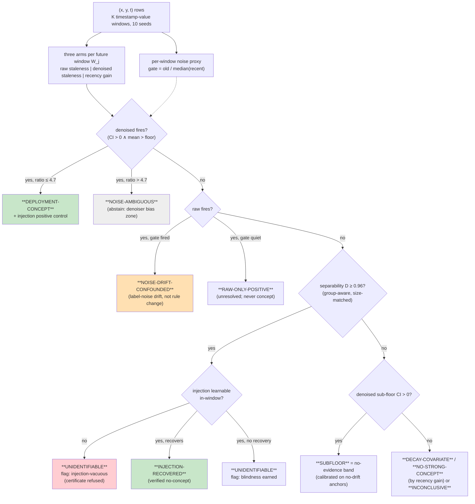

# Is There Exploitable Concept Drift in Industrial Tabular Data? A Pre-Registered Identifiability Audit

> DRAFT v4.6 (2026-07-18, reviewer-2's ledger grading answered: §6 fingerprint claim re-scoped
> to horizon-dominating recurrence (sine_reoccur2 is the in-paper counterexample; sub-window
> periodicity explicitly uncovered); Appendix C decision-constants table (calibration source +
> validity per constant); PREREG §14 pre-registers the [C]/[D] reading rules BEFORE the server
> runs. v4.5 (reviewer-2 adversarial review answered — the framing-level pass:
> abstract 0/8 bold now carries the tree-ensemble scope; "What we do not claim" adds the
> deep-architecture non-adjudication sentence; §6 adds the recurring-fingerprint-silent-on-
> every-industrial-cell sentence (artifact: all 8 cells recency ≥ 0, +0.000…+0.325, vs −0.023…
> −0.058 on oscillating streams); §3.2+§7(6) make injection certificates explicitly
> reference-family-relative; §5.3 sub-floor hedge; §6 EMBER "certificate-grade = identifiability,
> not magnitude" clarification. Server experiments queued: --tabred-span full (deployment-gap
> audit) + --inj-family sweep (both implemented & smoke-tested this round).
> Round 4 (typeset PDF — "effectively submittable"): orphan references restored as inline citations (Johansson→§2 positivity,
> Moreno-Torres→§3.1 estimand, Vela→§3.1 decay; \nocite removed), Fig. 2 aggregate band split
> to two lines so tiles render at natural size. Round 3: §2 EMBER numbers unified to the certificate-grade
> cell (−0.008/0.0013; the −0.012/0.0014 pair was the superseded full-history read); abstract
> certificate accounting made exact (identifiable null + unstable cell now covered); §1 panel
> accounting completed; §2 detector head-to-head scope sentence; §3.1 "cannot hurt" softened to
> a measured expectation; §4.1 five-seed justification; Fig. 2 color-redundancy note. Round 2
> (v4.2): abstract tightened; phantom "propositions" removed; compute + license appendix;
> sine_reoccur2 footnote; MLP-instability cause; reading aid; Figure 2; Appendix B rebuttal
> runs). Target: TMLR (immediate) /
> NeurIPS D&B (next cycle); reviewer-suggested alternates: ECML-PKDD, KDD research track,
> Machine Learning (Springer), DMKD — venues whose reviewer pools know the Gama/Webb definition
> debate this paper's estimand-narrowing speaks to. Supersedes
> PAPER_DRAFT_V3 (within-overlap lens era). Every number in this draft is traceable to a
> committed artifact: `prereg_results/` (run-meta-stamped JSONs), `audit_artifacts_2026-07-04/`
> (executed kill-tests), `PREREG_DEPLOYMENT_V2.md` §0–10 (rule→prediction→execution→read,
> evidenced by commit timeline). STATUS: full draft (Abstract + §1–8); citations verified
> 2026-07-15; **LaTeX = `paper/main.tex` (TMLR template, 4 tables + Figure 1, compiled &
> visually verified via tectonic 2026-07-16)**; KO fully synced. This md remains the prose/number
> source of truth — edit here first, then propagate to the .tex.

---

## Abstract

Which kind of temporal shift a tabular dataset exhibits — a changing rule P(y|x) or moving
covariates P(x) — is rarely measured, and we show the verdict depends on the measuring
instrument. We study *staleness harm*, a deployment-native probe: does adding old examples to a
fixed recent training set hurt future performance? Three executed failure modes make the naive
probe untrustworthy. Label-noise decay under a provably fixed rule mints a "concept drift"
verdict statistically matching a real industrial positive (+0.021 vs +0.024); the separability
gate that should certify nulls saturates under duplicate rows and entity cohorts; and the
concept/covariate separation is hypothesis-class-relative — kNN and linear probes false-fire
where tree ensembles read correctly. We repair the instrument — a cross-fitted *denoised
staleness* arm with a noise gate and a mapped abstention envelope, group-aware separability, and
learnability-gated injection certificates — and validate it on a 14-cell pre-registered battery
that includes rule change and noise drift co-occurring. A pre-registered audit of eight
industrial datasets (TabReD) with confirmatory fresh-seed replication (10/10 stable) then yields
an identifiability *map*, not a detection table: **no industrial dataset shows exploitable
mean-rule drift above its detectable floor for the deployed tree-ensemble class (0/8)**; the
sole robust positive is designed drift;
the one prior industrial positive is *diagnosed* by the instrument itself as label-noise decay;
every remaining cell is either an identifiable null or carries a certificate verdict — verified,
blind, refused, or (one cell) unstable. Anchor streams fix the
sensitivity profile: monotone and single-switch rule changes fire 9/9, and recurring regimes are
correctly silent with a negative-recency fingerprint. We release the instrument, battery, and
audit trail, and argue that drift-type attribution without identifiability certificates — the
current default in drift monitoring — is unreliable.

---

## 1. Introduction

Time-based splits on industrial tabular data collapse elaborate time-aware deep methods while
gradient-boosted trees survive (TabReD; Rubachev et al., 2025). The standard motivation for
time-aware architecture is *concept drift*: if the labeling rule P(y|x) changes over time, a
model that indexes, retrieves, or modulates by time should beat one that merely receives time as
a feature. But whether the rule actually changes on these benchmarks — as opposed to the
covariates P(x) moving under a fixed rule — has not been measured, and our central claim is that
measuring it is harder than the field assumes: **the concept/covariate verdict is a property of
the measuring instrument (its hypothesis class, its noise assumptions, its window geometry) as
much as of the data.** We make the measurement itself the object of study, in the setting a
deployed system actually faces: train on the past, predict the future, decide what to do with
old data.

**The probe.** We start from a deployment-native quantity we call *staleness harm*:

> staleness = score(train on recent N) − score(train on recent N ∪ old N), evaluated on a future
> window,

computed rolling-origin over K timestamp-value windows. Because the recent portion is identical
in both arms, covariate *coverage* cancels by construction: the only difference is N extra old
examples. If the rule is fixed, old examples carry correct labels and adding them should not
hurt; if the rule has changed, old labels contradict the current rule and pollute the fit —
staleness > 0. This construction (unlike train-window selection, which uses the same mechanics
for *adaptation*; Klinkenberg & Joachims, 2000) attributes *why* old data helps or hurts, and it
needs no importance weights, no density ratios, and no overlap between window supports to
compute — which is exactly what makes it attractive for industrial feature spaces where
overlap-based decompositions degenerate (D'Amour et al., 2021; Cai et al., 2023).

**Three executed failure modes.** The naive form of this argument — "correct labels can only
help" — is false for finite-capacity empirical risk minimization, and we show it fails silently
in three distinct ways, each demonstrated by a constructed null that the probe misreads:

1. **Label-noise drift (the diagnosis that motivated this paper).** A regression stream with a
   *fixed* conditional mean and label-noise standard deviation shrinking 1.5→0.3 over time mints
   a "concept" verdict at staleness +0.021 [+0.020, +0.023] — statistically indistinguishable
   from a real industrial positive we had previously obtained (+0.024 [+0.018, +0.030] on
   sberbank-housing). Old labels need not be *wrong* to hurt; being *noisier* suffices, because
   unweighted ERM is not efficient under heteroscedasticity. A second channel — x-dependent
   noise whose scale decays — fires the raw probe at +0.025 under an equally fixed rule.
2. **Overlap-gate saturation.** The natural certificate for "a null here is uninformative" is a
   window-separability AUC (can a classifier tell old rows from future rows?). Computed with a
   row-level train/test split, this gate saturates to 0.994–1.000 under exact duplicates, tight
   near-duplicates, and entity cohorts with *zero* covariate shift — the classifier memorizes
   rows, not distributions. Eight of ten real datasets read exactly 1.000 under the naive gate.
3. **Hypothesis-class relativity.** Rerunning the probe's own ground-truth suite with the model
   class swapped shows the concept/covariate *separation* is not a property of the probe design:
   a kNN probe reads pure covariate shift as concept drift (+0.098) and a linear probe reads
   prior shift as concept drift (+0.026), while HGB and random forests pass all controls. This
   is the empirical face of known theory (Shimodaira, 2000; Hinder et al., 2023): under
   misspecification, the ERM optimum depends on the training covariate distribution, so
   "old data hurts" can be manufactured by geometry alone.

**The repaired instrument.** Each failure mode gets a repair that is itself validated by
execution (§3–4): a *denoised staleness* arm that replaces old labels with cross-fitted
within-old-window model predictions — under noise-only drift the pseudo-labels are
approximately correct and the harm vanishes; under a changed rule they still encode the old rule
and the harm persists — plus a per-window *noise gate* with an explicitly mapped validity
envelope beyond which the instrument abstains; a group-aware, size-matched separability estimate
that deflates the memorization channel while leaving honest drift intact; and
*learnability-gated injection controls* that turn "this dataset is unmeasurable" from an
assumption into a demonstration: a known rule rotation is planted in the dataset's own covariate
geometry, verified to be learnable in-window, and only then is a persistent null allowed to
certify blindness. All verdicts are explicitly scoped to the tree-ensemble hypothesis class,
with linear and kNN probes carried as *canaries* whose false fires are reported, not hidden.

**The audit.** We pre-registered the decision cascade, thresholds, seed protocol, and aggregate
reading before the runs (rule → prediction → execution → read, evidenced by commit timestamps),
then audited eight TabReD datasets, Electricity, and the INSECTS streams, with a confirmatory
fresh-seed replication and a model-class panel. The result is not a detection table but an
identifiability map (§5): industrial mean-rule drift above the per-dataset detectable floor is
**0/8**; the designed-drift stream is the sole positive (and its denoised staleness *exceeds* the
raw one — the signature of genuine rule change); the single prior industrial positive is
*diagnosed* — not merely retracted — as label-noise decay, by the same instrument that once
minted it; two datasets earn a verified no-concept certificate via injection recovery; one earns
a blindness certificate; three fail to earn one (their injections are unlearnable — a fact the
naive protocol would have laundered into "earned blindness"); the panel's two remaining cells
are an identifiable null and one seed-unstable certificate, barred from claims. Anchor streams (§6) give the
instrument a coherent sensitivity profile — monotone and single-switch rule changes fire 9/9;
recurring regimes are correctly silent and are flagged by a negative recency gain, which is
impossible under one-way drift; malware (EMBER) reads as coverage-driven decay, not label rot,
consistent with how temporal degradation actually arises there (Pendlebury et al., 2019).

**Contributions.**
1. *An executed anatomy of drift-type attribution failure* (§3–4): three constructed nulls that
   silently mint concept-drift verdicts (noise decay, gate memorization, class relativity), each
   with magnitudes matching real borderline positives.
2. *A repaired, abstaining instrument* (§3): denoised staleness + noise gate with a mapped
   validity envelope; group-aware separability; learnability-gated injection certificates;
   class-scoped verdicts with canaries. Validated on a 14-cell pre-registered battery including
   the adversarial combinations (rule change *and* noise drift co-occurring must still fire —
   it does, at 58% of clean power).
3. *A pre-registered identifiability map of industrial tabular ML* (§5): 0/8 exploitable
   mean-rule drift; one diagnosed false positive with mechanism; per-dataset certificates and
   detectable-effect bounds; 10/10 confirmatory stability and 10/10 cross-class (HGB↔RF)
   agreement, with a real-data demonstration that a linear monitor flips the canonical
   Electricity dataset to "concept drift".
4. *A sensitivity profile with anchors* (§6): what this lens can and cannot see, established on
   designed-drift streams (fires iff old labels contradict the *current* regime), with the
   negative-recency fingerprint for recurring regimes and an honest malware null.

**What we do not claim.** We do not claim concept drift is absent from industrial tabular data —
several cells are certified *blind*, and blindness is not absence. We do not claim the
identifiability theory is new — that overlap failure blocks nonparametric identification is
classical (D'Amour et al., 2021; Ben-David et al., 2010), and the class-relativity principle is
established (Hinder et al., 2023); our contribution is the executed instrument, its failure
anatomy, and the certified map. And we do not claim model-agnosticism: every verdict is relative
to the deployed hypothesis class, which we argue is the only honest way to state drift-type
attribution at all. Finally, the map does not adjudicate what a *deep* time-aware architecture
could exploit: it fixes what the dominant deployed class has to exploit, and the battery (§4.3)
is the entry bar any richer probe must pass before its verdicts join the map.

## 2. Related Work

**Shift-type maps on tabular data.** WhyShift (Liu et al., 2023) is the closest prior: it
attributes performance drops to Y|X- vs X-shift across tabular datasets and concludes
Y|X-shifts are prevalent — on predominantly spatial/subpopulation axes, under an
overlap-assuming decomposition. Our delta is threefold: the *temporal* axis on deployed
industrial representations (where positivity actually fails and their lens degenerates), an
*abstention arm* with per-dataset certificates (WhyShift assumes the decomposition is
measurable), and the instrument-failure anatomy. DISDE (Cai et al., 2023) supplies the
decomposition formalism we inherit terminology from; its shared-distribution term is identified
only on common support — the boundary our map makes operational. TabReD itself (Rubachev et
al., 2025) frames everything as "gradual temporal shift" and contains no decomposition or
recency experiments; TableShift (Gardner et al., 2023) and Wild-Time (Yao et al., 2022) are
shift benchmarks without drift-type attribution.

**Identifiability and class-relativity.** That P(y|x) is not identified off-support without
assumptions is textbook positivity (D'Amour et al., 2021, for high-dimensional overlap failure;
Ben-David et al., 2010, for the learning-theoretic impossibility; Johansson et al., 2019, for
support failure inside learned representations). Hinder et al. (2023) prove
constructively that loss-based drift detection is class-relative in both directions — virtual
drift that moves the loss, real drift invisible to it — and their survey states "the used model
class is crucial." Loog et al. (2019) show ERM risk can be non-monotone in sample size even
i.i.d., closing the door on any unconditional "more correct data cannot hurt" lemma. Gower-Winter
et al. (2026) argue drift detection is ill-posed through windowing choices. We treat all of this
as settled theory that the applied drift-monitoring stack has not absorbed, and contribute the
executed demonstration + the repaired protocol; we state no theorems of our own — where the
paper sounds formal (the envelope, the certificates), the content is a measured boundary, not a
proved one.

**Old data harming.** Shimodaira (2000) is the mechanism for the misspecified case; the Data
Addition Dilemma (Shen et al., 2024) documents mixture harm empirically in clinical ML;
Klinkenberg & Joachims (2000) use held-out error over candidate training windows to *adapt*
window size. We are not aware of prior work that uses the add-old-data contrast as a
drift-*type* identifier with verdict semantics, or that reports the label-noise-decay
false-positive channel — under the field-standard definition of real drift as any change in
P(y|x) (Gama et al., 2014; Webb et al., 2016), noise drift *is* drift, which is precisely why an
instrument that claims to detect *exploitable rule change* must separate the two; we separate
them by construction and validate the separation adversarially.

**Pseudo-labels, denoising, cross-fitting.** The denoised arm's mechanics are deliberately
borrowed: replacing labels with model predictions is self-training (Scudder, 1965; Lee, 2013)
and distillation (Hinton et al., 2015); the view of noisy labels as recoverable by a fitted
model underlies noisy-label learning (Natarajan et al., 2013; Han et al., 2018); strictly
out-of-fold prediction to avoid own-fit contamination is cross-fitting (Chernozhukov et al.,
2018). What we take from these literatures is the estimator; the *use* — as the discriminating
arm of a drift-type verdict, with an adversarially mapped validity envelope and an abstention
rule — is the contribution we claim, and we scope it to its evidence: none of these adjacent
literatures, to our reading, reports the failure channel this arm exists to defuse.

**Drift detectors and their evaluation.** Classical detectors (surveys: Gama et al., 2014; Lu et
al., 2019) monitor loss or distribution statistics and are evaluated by injecting known drifts
into streams (Poenaru-Olaru et al., 2022); Detectron (Ginsberg et al., 2023) defines harmful
shift model-relatively. Our injection control differs in role: it is an *in-situ, per-dataset
power certificate* (planted in the real covariate geometry, learnability-gated), used to
distinguish earned blindness from instrument vacuity — a distinction we show matters on real
data, where three of four "unidentifiable" cells fail the learnability gate. We do not run
these detectors head-to-head on the audited cells: a loss-stream detector answers "did anything
change?" and is type-blind by construction, so its fires would not bear on drift-*type*
attribution; the canary panel (§4.3) is the like-for-like comparison — what a weaker
*attribution* instrument reports on the same bytes — and porting the certificate protocol to
streaming monitors is future work (§7).

**Malware.** TESSERACT (Pendlebury et al., 2019) established temporally honest evaluation in
malware and documents performance decay. Our EMBER read (old data *helps*; staleness −0.008;
detectable floor 0.0013) refines rather than contradicts it: the decay is coverage-driven (new
families appear — covariate expansion), not label rot (a 2017 malware sample is still malware),
which is exactly the distinction a deployment lens should draw.

## 3. The Instrument

**Figure 1.** The decision cascade (mermaid draft below; vector figure =
`paper/figures/fig1_cascade.tex`, compiled & verified). The
cascade is specified verbatim in §3.3 and PREREG §3.

Side channels drawn as annotations in the final figure: the strict-rule shadow verdict
(rule-sensitive flag), the negative-recency fingerprint for recurring regimes (§6), the
canary-probe panel (§4.3), and provenance stamping on every run.

*Reading aid.* One real cell exercises most of the vocabulary below. On sberbank-housing
(§5.3), the raw arm fires (+0.024) but the noise gate is on (2.1×) and the denoised arm is
negative — so the cascade returns NOISE-DRIFT-CONFOUNDED rather than concept; had all three
aligned inside the envelope, the verdict would have been DEPLOYMENT-CONCEPT, subject to an
injection positive control.

**Terminology (one line each).**

| term | meaning |
|---|---|
| raw staleness | future-window score(recent) − score(recent ∪ old); >0 = old data hurts |
| denoised staleness | same, with old labels replaced by cross-fitted within-old-window predictions; >0 = the *rule* changed |
| noise gate | old-window noise proxy / recent median; >1.5 = label-noise drift present |
| envelope | noise-ratio 4.7, the measured boundary of denoiser validity; above it the instrument abstains |
| D | window-separability AUC (group-aware, size-matched); a routing statistic, *not* support overlap |
| injection | a known rule rotation planted in the dataset's own geometry; the per-dataset power certificate |
| earned blindness | injection learnable in-window yet unrecoverable → the geometry genuinely hides this signal class |
| injection-vacuous | injection unlearnable → the null certifies nothing |
| no-evidence band | sub-floor CI-positive readings; calibrated on no-drift anchors as noise |
| canary probe | a deliberately misspecified probe class (linear/kNN) whose false fires are reported |
| rule-sensitive | verdict differs between the primary and strict decision rules; barred from headlines |

### 3.1 Setting and estimand

Rows (x_i, y_i, t_i) arrive over time; the auditor sees the full labeled history (retrospective
audit, not online prediction). Fix K windows by timestamp-value rank (ties never straddle
boundaries; per-seed boundary jitter). For each future window W_j (back half), with old anchor
W_0 (earliest window with ≥200 rows and a trainable label set) and recent window W_{j−1}, draw
size-matched samples (N = min(|recent|, |old|, 6000)) and train three models of the deployed
class: recent-only, old-only, recent∪old. Report per-seed means over future windows of

- **decay** = score(old model, held-out W_0) − score(old model, W_j) — aging, mechanism-blind
  (documented at scale by Vela et al., 2022);
- **recency gain** = score(recent) − score(old) on W_j — adaptation value, conflates coverage
  and rule change; *its sign is itself diagnostic (§6): negative recency is impossible under
  one-way drift and fingerprints recurring regimes*;
- **raw staleness** = score(recent) − score(recent∪old) on W_j — the attribution probe;
- **denoised staleness** = score(recent) − score(recent ∪ (X_old, ĝ_old(X_old))) on W_j, where
  ĝ_old is a 2-fold cross-fitted model *within* W_0 producing strictly out-of-fold hard
  pseudo-labels.

Scores: AUC (binary), accuracy (multiclass), −RMSE on z-scored targets (regression). CIs are
Student-t over 10 seeds; each seed re-draws a 90% row subsample, re-jitters window boundaries,
and re-samples all training sets. These are seed-level intervals over heavily overlapping
subsamples and are anti-conservative for tiny effects (§6 calibrates the resulting no-evidence
band on no-drift anchors); verdict-level inference does not rest on them alone — the
confirmatory fresh-seed replication (§5.1) is the operative stability check, and per-seed values
are emitted with every run so that alternative constructions (window-block bootstrap, split-half)
can be applied without re-execution. The pre-registered estimand is *exploitable mean-rule drift*:
a change in the decision-relevant functional of P(y|x) that makes old labels contradict the
current rule for the deployed hypothesis class. This is deliberately narrower than the
field-standard "any change in P(y|x)" (Moreno-Torres et al., 2012; Webb et al., 2016) — the
narrowing is the point, because
the wider definition classifies label-noise drift as concept and thereby licenses retraining
that cannot help.

**Why the denoised arm separates rule change from noise drift.** Under noise-only drift the
conditional mean/Bayes rule is unchanged, so ĝ_old estimates the *same* rule from noisy labels;
its pseudo-labels are approximately correct denoised labels, and adding (X_old, ĝ_old(X_old))
to the recent set has no remaining mechanism to hurt through (an expectation whose boundary
§4.2 measures, not a theorem) — executed: the +0.021 noise-decay false positive
collapses to +0.004 while the gate (below) flags the mechanism. Under genuine rule change,
ĝ_old consistently estimates the *old* rule; its pseudo-labels still contradict the current
rule, and the harm persists — executed: a rotating-rule stream keeps +0.541 of its +0.546 raw
signal, and rule-change-plus-noise-decay still fires at +0.316. The denoiser is not unbiased:
its pseudo-label error grows with old-window noise, and we *mapped the boundary* — at an
old/recent noise ratio ≈5.7 the denoised arm itself crosses the decision floor on a pure null
(+0.026). The instrument therefore carries an envelope constant (abstain above ratio 4.7) rather
than a pretense of a theorem; per Loog et al. (2019), no unconditional soundness lemma exists to
be had.

**The noise gate.** Per window, a fresh model of the deployed class is fit on 70% and its
held-out irreducible-error proxy recorded (regression: MSE on z-scored y; binary: 1−AUC;
multiclass: 1−accuracy). The gate statistic is old-window proxy / median recent-window proxy;
it fires above 1.5 (stable synthetic controls calibrate at 0.75–0.99) and defines the envelope
above 4.7. The gate alone is *not* a sufficient repair — a gate-veto rule would misfile genuine
rule change co-occurring with noise drift (executed: +0.316 must fire despite gate 3.67) — it
supplies the *mechanism label* (NOISE-DRIFT-CONFOUNDED) when the raw arm fires and the denoised
arm does not.

### 3.2 Certificates: separability, injection, learnability

**Window separability D (not "overlap").** D is the median held-out AUC of a classifier
separating W_0 from each back-half window, on the proxy-stripped feature space, with two
repairs over the naive version: size-matching by *random subsample* (a head-slice on
time-sorted rows manufactures separability from window-size imbalance — executed: shuffle-D
0.94 with no static feature, collapsing to 0.50 under the fix) and a *group-aware* train/test
split keyed on near-duplicate clusters (z-scored rows rounded to 0.1): exact duplicates at
multiplicity 5 inflate row-split D to 0.994 and entity cohorts to 1.000 with zero covariate
shift; the group split returns both to ≈0.50 while honest drift keeps D high. We report D as
*separability*, never as support overlap: a single genuinely predictive drifting feature
saturates it, so D ≥ D* = 0.96 routes a staleness null to the injection control rather than
concluding anything by itself.

**Learnability-gated injection.** For any candidate-unidentifiable dataset (and, as a positive
control, for any CONCEPT verdict), a reference concept — a rule rotation of fixed strength on
the two highest-variance features — is planted in the dataset's own (X, t) geometry and the full
staleness pipeline re-run (10 seeds, same power as the main read). Before the null is allowed to
mean anything, the injected rule must be *learnable in-window* (held-out AUC ≥ 0.65 / R² ≥ 0.20
/ accuracy ≥ majority + 0.10): executed on a constructed geometry whose top-variance features
are heavy-tailed junk, the injected rule is unlearnable (in-window AUC 0.506) and the naive
protocol grants "earned blindness" vacuously; the gate converts that to *injection-vacuous* —
certificate refused. Outcomes: recovery (⇒ the real null was informative: verified no-concept),
earned blindness (learnable but unrecoverable ⇒ the geometry genuinely hides this signal
class), or vacuity (no certificate). On the real audit, this distinction is load-bearing: 3 of 4
"unidentifiable" industrial cells fail the learnability gate. The certificate is explicitly
relative to this reference family: recovery certifies power against rotations carried by the
dataset's high-variance directions, not against rule changes living in low-variance features,
interactions, or subpopulations (§7, Limitation 6).

### 3.3 Decision cascade and scope

The pre-registered cascade (PREREG §3; verbatim in the artifact): DEPLOYMENT-CONCEPT requires
the *denoised* arm to fire (CI lower bound > 0 and mean > 0.02) within the noise envelope; a raw
fire with the gate on is NOISE-DRIFT-CONFOUNDED; a raw fire with the gate off is
RAW-ONLY-POSITIVE (unresolved, never concept); nulls route through D to the injection
certificates; a sub-floor denoised CI is reported as a no-evidence band (calibrated: 2/5 no-drift
anchor streams land there at 1/10–1/20 of the floor — CI-significant, decision-irrelevant). A
strict secondary rule (CI lower bound > floor) is computed alongside; any cell whose verdict
differs between the two readings is marked rule-sensitive and barred from headlines. Every
verdict is scoped to the deployed hypothesis class: the ground-truth suite passes under HGB and
random forests and fails under linear/kNN probes (§4), so tree-ensemble verdicts are
decision-grade and linear/kNN run as canaries. All runs emit provenance metadata (commit, argv,
library versions, seeds) into versioned artifacts; the decision rules, thresholds, seed
protocol (exploratory 0–9, confirmatory 100–109), and aggregate reading were committed before
the runs they govern. Appendix C tabulates every decision constant with its calibration source
and validity range.

## 4. Validation: the battery, the envelope, and the class matrix

### 4.1 The 14-cell pre-registered battery

The instrument must pass a synthetic ground-truth battery before any real-data run (PREREG §4);
the battery is itself the executed record of the failure anatomy. All cells: n = 12,000, d = 10,
K = 10, 5 seeds (vs ten on real data — the planted effects are 10–27× the decision floor and
the battery is a pass/fail gate, not an estimation exercise); verdicts under the full cascade.

| cell (truth) | raw | denoised | gate | verdict |
|---|---|---|---|---|
| rotating rule (binary) | +0.280 | +0.289 | 0.90 | **CONCEPT** ✓ |
| rotating rule + drifting nuisance | +0.203 | +0.206 | 1.18 | **CONCEPT** ✓ (proxy-stripped) |
| rotating rule (regression) | +0.546 | +0.541 | 0.91 | **CONCEPT** ✓ |
| **rotating rule + noise decay** | +0.357 | **+0.316** | 3.67 (fires) | **CONCEPT** ✓ — the gate must not veto |
| covariate shift, fixed rule | −0.001 | −0.000 | 0.74 | UNIDENT (blindness earned) ✓ |
| stationary | −0.001 | −0.000 | 0.75 | NO-STRONG-CONCEPT ✓ |
| prior shift, fixed rule (multiclass) | −0.003 | −0.004 | 0.84 | UNIDENT, injection-vacuous ✓ |
| mild covariate shift (D = 0.73, un-gated) | −0.003 | +0.001 | 0.99 | NO-STRONG-CONCEPT ✓ — the null is load-bearing, not gated away |
| stationary (regression) | −0.012 | −0.002 | 0.99 | NO-STRONG-CONCEPT ✓ |
| covariate shift, fixed *linear* rule (reg.) | +0.002 | +0.004 | 0.91 | UNIDENT ✓ (never CONCEPT) |
| covariate shift, fixed *nonlinear* rule (reg.) | −0.005 | −0.003 | 0.92 | UNIDENT ✓ |
| **label-noise decay, fixed rule** (the F1 killer) | **+0.021 fires** | +0.004 | 3.54 | **NOISE-DRIFT-CONFOUNDED** ✓ |
| label noise *growing*, fixed rule | −0.023 | −0.019 | 0.14 | NO-STRONG-CONCEPT ✓ |
| **x-dependent noise, decaying scale** | **+0.025 fires** | +0.005 | 3.76 | **NOISE-DRIFT-CONFOUNDED** ✓ |

Three cells carry the paper's argument. The noise-decay cell is the executed refutation of
"correct labels cannot hurt": the raw probe fires at a magnitude (+0.021) that matched a real
industrial positive to within 0.003. The x-dependent-noise cell is a *second* raw false-positive
channel, discovered during adversarial review of the repair itself; a third (noise scale
correlated with the rule feature — the denoiser's worst case, since pseudo-label error then
concentrates where the signal lives) was constructed by an independent red-team pass and also
defused (raw +0.026 fires; denoised +0.006, null). The concept-plus-noise cell establishes that
the repair keeps power where both mechanisms co-occur: denoised retention is 58% of the clean
rotating-rule signal (+0.316 vs +0.541), and the same holds at small rule-change magnitudes
(a 0.8-rad rotation: clean denoised +0.108, with noise decay +0.062 — attenuated, still firing).
Robustness of the denoiser to a small old window was checked directly (old window capped at 600
rows, cross-fit folds of 300): no false positive (+0.004) and no false negative (+0.430).

**Floor comparability across metrics.** The 0.02 decision floor is shared across AUC, accuracy,
and z-scored −RMSE, which are not decision-equivalent units. Two mitigations are structural:
every null carries its own detectable-effect bound δ (the per-dataset, per-metric power
statement that does the aggregate's real work), and CONCEPT never rests on the floor alone (the
denoised CI, gate, and envelope must all align). As a sensitivity check, re-thresholding all
committed runs under per-metric floors rescaled by the battery's matched-strength concept
magnitudes (binary +0.28 vs regression +0.55 ⇒ regression floor 0.04) moves no cell across the
concept/no-concept boundary; the only affected cell is the mechanism label of the diagnosed
regression positive (§5.3), which is already flagged rule-sensitive and barred from headlines.

### 4.2 The envelope: where the repair itself breaks

The denoiser is biased — pseudo-label error grows with old-window noise — and rather than
assuming the bias negligible we mapped it: on pure fixed-rule nulls, the denoised arm reads
+0.0037 at noise-ratio 3.54, +0.0048 at 3.76, +0.0043 at 3.87, +0.0140 at 4.72, and **+0.0259 at
5.71 — across the 0.02 decision floor on a null**. The instrument therefore abstains
(NOISE-AMBIGUOUS) above ratio 4.7. Separation still exists beyond the envelope (at ratio ≈6, a
true rotating rule reads denoised +0.086 vs the null's +0.026, disjoint CIs), but any threshold
there would be calibrated on a single noise family, so we refuse the verdict instead. Stable
controls calibrate the gate statistic at 0.75–0.99, far from the 1.5 firing threshold; every
real-data gate value in §5 falls either clearly below 1.5 or in 2.0–2.9 — nowhere near the
envelope edge.

### 4.3 The model-class matrix: why verdicts are class-scoped

Re-running the five core controls with the probe's model class swapped (the instrument's every
component — staleness arms, gate, separability, injection — follows the swap):

| control (truth) | HGB | RandomForest | MLP (64,32) | linear | kNN |
|---|---|---|---|---|---|
| rotating rule | ✓ (+0.280) | ✓ (+0.287) | ✓ (+0.305) | ✓ (+0.310) | ✓ (+0.295) |
| covariate shift, fixed rule | ✓ (−0.001) | ✓ (+0.004) | △ (den +0.045, CI-saved) | ✓ (−0.002) | **✗ CONCEPT (+0.098)** |
| prior shift, fixed rule | ✓ (−0.003) | ✓ (+0.003) | **✗ CONCEPT (den +0.042)** | **✗ CONCEPT (+0.026)** | **✗ CONCEPT (+0.048)** |
| stationary | ✓ | ✓ | ✓ | ✓ | ✓ |
| rotating rule + nuisance | ✓ (+0.203) | ✓ (+0.200) | ✓ (+0.228) | ✓ (+0.229) | ✓ (+0.219) |

Concept *detection* is class-robust (all five classes fire on true rotations); the
concept/covariate *separation* — the property the verdict rests on — holds only for classes
flexible enough to represent the fixed rule. This is Shimodaira (2000) made empirical: under
misspecification the mixture-ERM optimum moves with P(x), so covariate shift alone manufactures
"old data hurts." Denoising does not repair this channel (kNN still false-fires at +0.111 with
pseudo-labels — the misspecification is in the *probe*, not the labels), which is why the
instrument's verdicts are stated as tree-ensemble-scoped, with linear/kNN carried as canaries.
The neural probe deserves emphasis, because the paper's motivating question is whether deep
tabular architectures have a rule change to exploit: **a two-layer MLP probe fails the
separation battery** — it reads fixed-rule prior shift as concept drift (denoised +0.042, a
fire) and leans positive on pure covariate shift (denoised +0.045, saved only by CI width) — so
it joins the canaries rather than the decision-grade classes. We do not claim this extrapolates
to modern deep tabular architectures at scale; we claim the direction of the burden: a probe
class earns drift-verdict authority by passing this battery, and the first neural probe we
tested does not. The practical reading for the field is uncomfortable: **a drift monitor built
on a linear, local, or small-neural probe can report concept drift on data where a
tree-ensemble monitor reports none, on the same bytes** — and §5.4 shows this happens on the
canonical real drift dataset, not just in synthetics.

## 5. The Map

### 5.1 Protocol

Eight TabReD datasets (Rubachev et al., 2025; train segments of the official temporal splits),
Electricity (elec2), and INSECTS (incremental-balanced) — HGB probe, K = 10, 10 exploratory
seeds (0–9), then a **confirmatory rerun with fresh seeds (100–109)**; any verdict that moves
between the two is reported unstable and barred from claims. Decision cascade, thresholds, seed
protocol, and the aggregate reading were committed before execution; the prior (v2-era)
industrial positive was pre-registered as a *retraction candidate with a prediction*
(NOISE-DRIFT-CONFOUNDED or denoised-null), and a survival battery was pre-specified in case the
prediction failed. Both the primary rule (CI > 0 ∧ mean > floor) and the strict rule
(CI > floor) are computed; rule-sensitive cells are flagged.

### 5.2 Results: 10/10 confirmatory-stable; industrial mean-rule drift 0/8

**Figure 2.** The map at a glance (vector source `paper/figures/fig2_map.tex`): one tile per
dataset, colored by verdict class — green = rule-change verdict or verified no-concept, amber =
diagnosed noise mechanism, blue = identifiable null, light blue = earned blindness, red =
certificate refused, grey = unstable — with the load-bearing number (denoised staleness or
injection recovery) inside each tile. Color is redundant: every tile also prints its verdict
(color-vision-safe). The table below is the precise record.

| dataset | verdict (= confirmatory) | raw | denoised | gate | certificate |
|---|---|---|---|---|---|
| insects | **DEPLOYMENT-CONCEPT** | +0.135 / +0.129 | **+0.152 / +0.145** | 1.24 | injection recovers (+0.162) |
| sberbank_housing | **NOISE-DRIFT-CONFOUNDED** | +0.024 / +0.033 (fires) | **−0.015 / −0.011** | **2.11 / 2.21 (fires)** | — (diagnosed, §5.3) |
| cooking_time | INJECTION-RECOVERED | −0.011 | −0.018 | 0.92 | **verified no-concept** (inj +0.55) |
| delivery_eta | INJECTION-RECOVERED | −0.012 | −0.014 | 0.89 | **verified no-concept** (inj +0.33) |
| maps_routing | NO-STRONG-CONCEPT | −0.008 | −0.010 | 1.01 | identifiable region (D 0.58) |
| elec2 | UNIDENTIFIABLE | +0.001 | +0.001 | 0.66 | **blindness earned** (inj learnable, +0.018) |
| ecom_offers | UNIDENTIFIABLE | −0.001 | −0.007 | 1.25 | *vacuous* — injection unlearnable |
| homecredit_default | UNIDENTIFIABLE | −0.007 | +0.004 | 1.29 | *vacuous* (80 proxy features stripped) |
| weather | UNIDENTIFIABLE | −0.012 | −0.011 | 0.93 | *vacuous* |
| homesite_insurance | UNIDENTIFIABLE-INERT | −0.004 | −0.002 | 1.14 | *unstable* (vacuous↔earned across seed sets) |

(Where two numbers are shown: exploratory / confirmatory.) The pre-registered aggregate reading:
**relative to the tree-ensemble class, the number of industrial datasets with exploitable
mean-rule drift above the per-dataset detectable floor is 0/8.** The only concept positive is
the designed-drift stream, where the denoised arm *exceeds* the raw arm — pseudo-labels encode
the old rule cleanly once label noise is removed, the signature of genuine rule change. Three of
four blindness claims that a naive protocol would have granted turn out to be *vacuous* (the
planted probe rule is unlearnable in those geometries — their top-variance features cannot carry
it), a distinction invisible without the learnability gate. The strongest cells in the map are,
counter-intuitively, the two verified no-concept certificates: geometry demonstrably has power
(+0.55/+0.33 recovery of a planted rule) and the real staleness is still null.

### 5.3 The diagnosis: how the instrument caught its own prior positive

The v2-era instrument (raw arm only) had reported sberbank-housing — the panel's one regression
dataset — as its sole industrial concept positive (+0.024 [+0.018, +0.030]). The audit
constructed the noise-decay null of §4.1 at matching magnitude; the v3 rerun then delivered the
diagnosis. Across window resolutions K ∈ {5, 8, 10, 12, 20}: the raw arm fires at K ∈ {8, 10,
12} (at K = 10 reproducing the v2 headline **bit-for-bit** at +0.0239 — full precision
+0.023900573591226625, footnoted in the typeset version and recorded in the artifact; the raw
pipeline's RNG stream is unchanged, so this is the *same* signal reinterpreted, not a
re-measurement that happened to differ); the old window's measured noise proxy is 2.1–2.9× the
recent median at every K; and the **denoised arm is significantly negative at every K** (−0.014
to −0.018, all CIs below zero): replace the old labels with cross-fitted pseudo-labels and the
old rows *help*. The rule did not change; the early labels are noisier — consistent with
2011–2012 crisis-era Russian housing prices. At K = 20 the injection control recovers a planted
rule (+0.101) through the same geometry, and at no K does any rule reading yield CONCEPT. (The
diagnosis is of the minted positive; it does not exclude a residual rule change below the floor
co-occurring with the noise decay — no sub-floor claim is made in either direction.) We are
not aware of a prior case of a drift-attribution instrument diagnosing the *mechanism* of its
own earlier false positive on real data, as opposed to merely failing to replicate it.

### 5.4 The class panel on real data

The decision-grade classes agree: **HGB and random-forest verdicts match operatively on 10/10
datasets** (one sub-label difference). The canaries do not — and the flip that matters is
replicated across two independent canary classes: **both the linear probe (raw +0.023, denoised
+0.033, injection recovers +0.190) and the MLP probe (raw +0.007, denoised +0.025) read
Electricity as DEPLOYMENT-CONCEPT** where the tree-ensemble probe reads it
unidentifiable-with-earned-blindness. Electricity is the literature's canonical concept-drift
dataset; whether a monitor confirms that reputation depends on the probe class, on identical
data. The MLP panel also illustrates why canary verdicts must not be consumed directly: on the
regression datasets its staleness estimates are numerically unstable (sberbank CI spanning ±15
z-units; weather CI width 0.5) — driven by a few divergent fits: on sberbank, three of ten seeds
land at |staleness| > 10 z-units while the other seven lie within ±2 (per-seed values in the
committed artifact), i.e., occasional optimization failure of the un-tuned probe rather than
signal — and no TabReD cell produces a new positive under it — the
decision-grade map is unchanged. A second canary behavior is worth reporting as a
warning: on ecom_offers the linear probe fires the *denoised* arm only (+0.028) with the raw arm
null (−0.002) — a denoiser-artifact channel specific to misspecified probes (the linear ĝ_old's
systematic error is itself informative to the linear downstream model), reinforcing that the
denoised arm's semantics are also class-scoped.

## 6. Anchors and the Sensitivity Profile

The map's credibility rests on knowing what the instrument *can* see. We ran it over 23
synthetic river streams (SEA/Agrawal/STAGGER/Sine/Hyperplane; no-drift / abrupt single-switch /
gradual / reoccurring variants) and all seven INSECTS variants (real sensor data, lab-controlled
temperature drift; Souza et al., 2020).

**Monotone and single-switch rule changes fire: 9/9.** River: agrawal_abrupt +0.045,
agrawal_gradual +0.047, stagger_abrupt, sine_abrupt +0.031, hyperplane_incremental +0.113 (with
the gate correctly co-flagging its noise component), sine_reoccur2 +0.047 [reoccurring in name
only for this lens's horizon: the stream returns to its initial regime just in its final ~22%,
so most evaluated back-half windows sit inside the middle regime, whose rule is a near
label-inversion of the anchor's — its recency gain is strongly *positive* (+0.30), the opposite
of the recurring fingerprint, and geometry-matched siblings whose middle regime is not
label-inverting read ≈0 (sine_reoccur −0.003, sine_reoccur3 −0.003)]. INSECTS:
gradual-balanced +0.092, gradual-imbalanced +0.069, incremental +0.135 — in every firing cell,
denoised ≥ raw, and the injection positive-control recovers. Weak switches (SEA's threshold
nudge) land in the no-evidence band with consistent sign, reported with their detectable floors.

**Recurring regimes are correctly silent — and fingerprinted.** INSECTS abrupt variants
(oscillating temperature) read *negative* staleness (old data helps: −0.070, −0.027) with
**negative recency gain** (−0.058, −0.023): the window adjacent to the test predicts it *worse*
than the oldest window does. Negative recency is impossible under one-way drift; it is the
signature of a regime that has returned. The same pattern holds across river's reoccurring
cells and INSECTS incremental-reoccurring — three independent confirmations. This is a scope
statement, not a defect: the lens answers the deployment question ("does old data harm a model
trained today?"), and when old regimes recur, old data genuinely does not harm — recency does.
A monitor built on this lens will not *detect* recurring concept drift; it will correctly tell
you old data is safe to keep, and its negative-recency flag tells you why. On the audited panel
that flag is silent: every industrial cell reads recency gain ≥ 0 (from +0.000 on maps_routing
to +0.325 on sberbank-housing), nowhere near the recurring signature (−0.023 to −0.058 on the
oscillating streams). This is deliberately a scoped statement: negative recency certifies
recurrence only at scales that dominate the evaluation horizon — our own sine_reoccur2 anchor
shows a late-returning regime (final ~22%) reading recency +0.30 — and drift at sub-window
timescales is averaged away (§7, Limitation 2). The silent flag therefore rules out
horizon-dominating recurrence on the audited panel; it says nothing about late, brief, or
sub-window-periodic returns (intraday or day-of-week seasonality included), which remain
uncovered by this check.

**Calibration of the no-evidence band.** Two of five no-drift anchor streams produce
"CI-significant" sub-floor denoised positives at 1/10–1/20 of the decision floor — seed-level
CIs on overlapping subsamples are anti-conservative at tiny magnitudes. Accordingly, the
sub-floor band is read as *no evidence* everywhere in this paper, a calibration the anchor suite
forced and the pre-registration records.

**Malware (EMBER).** On 2018-dense monthly windows the cell is certificate-grade:
DEPLOYMENT-DECAY-COVARIATE with D = 0.834 (identifiable — the null carries full weight), raw
staleness −0.008 [−.009, −.007] (old data helps), denoised −0.004, gate quiet, recency gain
+0.031 above the floor, detectable floor 0.0013. ("Certificate-grade" refers to
identifiability, not magnitude: the mechanism label rests on the above-floor recency gain and
the significantly negative staleness; the no-evidence-band discipline governs sub-floor
*positives* and is not invoked here.) Malware's temporal degradation (Pendlebury et
al., 2019) is real and recency-recoverable, but it is coverage-driven — new families appear;
old labels do not rot — and the deployment lens draws exactly that distinction: keep the old
data, expect decay anyway, retrain for coverage. (A full-history windowing over 126 sparse
months gives the same null at lower power, and a mis-windowed attempt on 19-row windows
correctly refused to emit a verdict.)

**The WhyShift bridge (ACS across years).** WhyShift reported Y|X-shifts as prevalent on
ACSIncome across *states*; running the instrument on the same task across *years* (California,
2014–2018, yearly windows, 10 seeds) yields the map's best-powered null: NO-STRONG-CONCEPT with
raw −0.008 and denoised −0.007 (both CIs negative — old years help), gate quiet, D = 0.515
(the years are barely separable in feature space — negligible covariate movement, fully
identifiable), recency ≈ 0, and a detectable floor of 0.0008. The same task whose spatial axis
exhibits prevalent Y|X-shift is temporally quiet over five years — the axis, not just the
dataset, determines the shift type. (An overlap-based decomposition run on the same cell
agrees: within-overlap gap −0.009 ≈ placebo −0.008 at cov-AUC 0.68 — Appendix B.2.) The cell also passes a real-data analogue of the
prior-shift control: the fixed $50k income threshold under inflation produces a monotone
positive-rate ramp (0.36→0.42), and the instrument does not misread that prior drift as
concept. (Scope: one state, five pre-COVID years; a multi-state extension is future work.)

## 7. Discussion

**What a practitioner gets.** Raw staleness answers "does old data hurt?"; the repaired
instrument answers "*why*, and what to do about it," with a decision rule per cell: a denoised
fire inside the envelope ⇒ the rule changed for your model class — old labels are poison,
retrain recent-only or add temporal structure; a raw fire with the gate on ⇒ your labels' noise
profile drifted — old rows are *reusable* via self-training (the denoised arm is literally that
remedy, measured); nulls with a recovery certificate ⇒ retraining chases coverage, not rule
change; negative recency ⇒ regimes recur — retention, not recency, is your friend; vacuous or
unstable certificates ⇒ do not let a monitor speak about this dataset's drift type at all.

**What the map means, and does not.** The 0/8 aggregate does *not* say concept drift is absent
from industrial tabular ML: three cells are certificate-less and one is blind-but-certified;
blindness is not absence. It says something narrower and, we argue, more useful: on the
benchmark the field uses to argue for time-aware tabular architectures, **no measurable
mean-rule drift exists for the model class that dominates those benchmarks, and every apparent
counterexample so far has dissolved under controls** — the last one into label-noise decay,
diagnosed rather than asserted. The burden of proof for "temporal architecture X exploits
concept drift on TabReD-like data" should now include an identifiability certificate.

**Limitations.** (1) Verdicts are tree-ensemble-scoped; we show this scoping is necessary, not
that it is sufficient for every deployed system. The panel's neural probe (a two-layer MLP)
fails the separation battery and is classified a canary (§4.3); modern deep tabular
architectures (FT-Transformer-class, at production scale) remain untested — extending the panel
is the clearest next step, with the battery as the pre-registered entry bar any such probe must
pass before its drift verdicts are trusted. (1b) **Scale.** The probe trains on N ≤ 6,000 rows
per arm; industrial models train on orders of magnitude more. A rule change exploitable only at
much larger N is invisible here, so every δ bound and the 0/8 aggregate are statements *at probe
scale*. A first δ(N) sweep (Appendix B.1) raises the arm cap to the window-geometry ceiling
(N ≈ 14k–24k, up to 4× the headline scale) on the three largest null cells: every verdict is
unchanged and no reading trends toward the floor. Production-scale N beyond that remains future
work, and we flag rather than dismiss the possibility that the map changes there. (2) K = 10 rolling windows with a fixed early
anchor: drift at time scales far below the window width is averaged away (the injection control
partially measures this — its recovery varies with K), and the TabReD map covers the train
segments of the official splits, not the held-out deployment gap. (3) The single robust positive
is lab-designed drift; we found no naturally occurring industrial positive to calibrate
magnitude against — that is the map's finding and its weakness simultaneously. (4) The envelope
constant (4.7) is calibrated on Gaussian noise families; heavy-tailed label noise inherits only
the abstention discipline, not the exact boundary. (5) TabReD is curated to be temporally
splittable; external validity to industrial data at large is an inductive step we flag rather
than take. (6) The injection certificates are calibrated on a single reference family —
fixed-strength rotations on the two highest-variance features; power against low-variance,
interaction-borne, or subpopulation-local rule change is not certified, so "verified no-concept"
should be read as verified against that family. An injection-family sweep is the corresponding
hardening step.

**On process.** This project's ledger records nine positive findings that dissolved under
scrutiny before the present result; the ninth dissolution is §5.3, and it is the only one the
measuring instrument itself diagnosed. The methodological claim we stand behind is that the
combination that finally produced a stable result — executed adversarial nulls before real-data
claims, pre-registered cascades with commit-timestamped predictions, confirmatory fresh-seed
replication, certificates instead of assumptions, and canary probes — is cheap relative to the
cost of the dissolutions it prevents, and we release the audit trail as part of the artifact.

**Future work.** Multi-state and post-2019 extensions of the ACS bridge (§6); class-invariance
conditions for the denoised arm (when does a probe family admit *any* sound staleness
reading?); a δ(N) scaling study; and porting the certificate protocol to streaming monitors,
where the recurring-regime fingerprint (negative recency) is directly actionable.

## 8. Reproducibility

Everything is in one repository, linked in anonymized form for review. The instrument is a
single sklearn-only script
(`scripts/run_deployment_decay.py`); every stochastic step is seeded, and every output artifact
embeds its commit hash, argv, library versions, and UTC timestamp. **Compute.** Every run in
the paper is CPU-only — the instrument and all probe classes are scikit-learn models; no GPU is
used anywhere — executed single-node on one shared multicore Linux server (Python 3.11.15,
scikit-learn 1.9.0, NumPy 2.4.6; the environment freeze is committed). Wall-clock is
reconstructable from the committed phase logs: the main pre-registered phases ran phase-parallel
in ≈17 h on one calendar day, the model-class panel adds ≈2 h, and the optional cells (EMBER,
the ACS bridge, canary reruns) ≈13 h across two further days; no single dataset cell exceeds a
few CPU-hours. Per-source data access and license terms are tabulated in Appendix A. The synthetic battery is
byte-reproducible (re-running `--synth` regenerates the committed artifact SHA-identical on the
same environment), and the raw arm's RNG stream is stable across instrument versions (the v2
headline number reproduces bit-for-bit under v3, which is what makes §5.3 a reinterpretation
rather than a re-roll). The pre-registration (`PREREG_DEPLOYMENT_V2.md`) freezes thresholds,
cascade, seed protocol, and aggregate reading, with results appended as read-only sections whose
ordering is enforced by the git history; all server runs are reproduced by one resumable driver
(`scripts/run_prereg_phases.sh`, marker-based, phase-parallel), and the environment freeze of
the machine that produced the headline numbers is committed. Data access: TabReD requires
Kaggle authentication and per-competition rule acceptance; elec2 fetches from OpenML; INSECTS
and the river panel install via `river`; EMBER-2018 downloads from its public archive and is
parsed by a dependency-free adapter. Exact cross-version bit-reproducibility of
HistGradientBoosting across sklearn releases is *not* claimed; verdict-level stability across
seed sets and across HGB/RF is (10/10 and 10/10, §5).

## Appendix A. Data access and licenses

Verified 2026-07-18 against each distributor:

| source | access path in the pipeline | license / terms |
|---|---|---|
| TabReD (8 industrial datasets) | Kaggle, via the TabReD preprocessing tooling | per-competition Kaggle rules (acceptance required); TabReD tooling Apache-2.0 |
| Electricity (elec2) | OpenML dataset 151 | listed "Public" by OpenML |
| INSECTS (7 variants) | fetched through the `river` package | `river` BSD-3-Clause; dataset introduced by Souza et al. (2020) |
| river synthetic streams (SEA/Agrawal/STAGGER/Sine/Hyperplane) | generated by `river` | BSD-3-Clause |
| EMBER-2018 | public archive download; parsed by our dependency-free adapter | data files MIT (the ember *code* is AGPL-v3 and is not used) |
| ACS (folktables bridge) | `folktables` | folktables MIT; ACS PUMS is public U.S. Census Bureau data |

## Appendix B. N-scaling and cross-lens agreement (post-hoc robustness checks)

Both checks were run after the pre-registered audit froze, with the instrument, cascade, and
thresholds unchanged (commit-stamped artifacts); they are robustness checks, not pre-registered
cells.

**B.1 δ(N): the map does not move toward the floor as N grows.** The probe's headline scale is
N ≤ 6,000 (§7, Limitation 1b). We re-ran the three largest null cells with the arm cap swept
over {1,500, 24,000, 96,000} (10 seeds each). Window geometry bounds the realizable arm size
(N = min(|recent|, |old|, cap), and |window| ≈ n/K), so the realized ceilings are ≈17,200 on
homecredit_default (the 96,000 cap realizes the same N), 24,000 on weather (cap-bound), and
≈14,300 on maps_routing. Verdicts are unchanged at every N, and nothing trends toward the 0.02
floor:

| cell | realized N | raw staleness | denoised | verdict |
|---|---|---|---|---|
| homecredit_default | 1,500 | −0.015 [−.018, −.012] | +0.007 [+.005, +.008] | UNIDENT (vacuous) — unchanged |
| homecredit_default | 6,000 (Table §5.2) | −0.007 | +0.004 | unchanged |
| homecredit_default | ≈17,200 (cap 24k) | −0.013 [−.016, −.011] | +0.006 [+.004, +.007] | unchanged |
| homecredit_default | ≈17,200 (cap 96k) | −0.010 [−.012, −.009] | +0.005 [+.003, +.006] | unchanged |
| weather | 1,500 | −0.017 [−.019, −.015] | −0.022 [−.024, −.020] | unchanged |
| weather | 6,000 (Table §5.2) | −0.012 | −0.011 | unchanged |
| weather | 24,000 | −0.005 [−.006, −.005] | −0.002 [−.002, −.002] | unchanged |
| maps_routing | 1,500 | −0.009 [−.010, −.009] | −0.017 [−.017, −.016] | NO-STRONG-CONCEPT |
| maps_routing | 6,000 (Table §5.2) | −0.008 | −0.010 | unchanged |
| maps_routing | ≈14,300 (cap 24k) | −0.008 [−.009, −.008] | −0.008 [−.009, −.008] | unchanged |

Raw staleness is significantly *negative* (old data helps) at every N on all three cells; the
one sub-floor positive (homecredit's denoised arm) sits at a quarter of the decision floor, is
flat across an 11× range of N, and shrinks at the top of the range; weather's denoised arm
converges to ≈0 from below. The injection certificates reproduce (homecredit/weather planted
rules remain unlearnable — vacuous; maps identifiable). Scope unchanged: K = 10 window geometry
caps realizable N at ≈14k–24k here, so production-scale N beyond that remains untested.

**B.2 Cross-lens agreement where overlap holds.** On the two cells of the map whose
separability leaves an overlap-based decomposition applicable (maps_routing, D = 0.58; the ACS
bridge, D = 0.515), we ran the WhyShift-style within-overlap concept decomposition (ess-gated)
next to the deployment lens. The two instruments agree:

| cell | deployment lens | within-overlap gap [CI] | note |
|---|---|---|---|
| maps_routing (full, 986 feats) | NO-STRONG-CONCEPT (den −0.010) | −0.003 [−.004, −.002] | measurable 5/5 seeds, ESS 93% |
| maps_routing (sparse MI@5/10/20/50) | unchanged | −0.005 … −0.005, all ≈0 | measurable under every representation |
| ACS CA 2014→2018 | NO-STRONG-CONCEPT (den −0.007) | −0.009 (placebo −0.008) | cov-AUC 0.68; gap ≈ placebo |

Where overlap holds, the overlap lens and the deployment lens return the same verdict; the
instrument disagreements this paper documents (§3–4) arise precisely where overlap fails —
which is why verdicts must carry certificates.

## Appendix C. Decision constants: calibration sources and validity

Every decision constant in the cascade, with where it was calibrated and where it stops being
valid. The instrument ports to a new domain by re-running this calibration recipe (the battery
of §4.1 plus the no-drift anchors of §6), not by reusing the numbers.

| constant | value | role | calibrated on | validity / outside behavior |
|---|---|---|---|---|
| decision floor | 0.02 | CONCEPT magnitude bar, shared across AUC / accuracy / z-scored −RMSE | battery concept magnitudes (planted effects 10–27× the floor); per-metric rescaling moves no cell (§4.1) | sub-floor CI-positives = no-evidence band, calibrated on no-drift anchors (2/5 land at 1/10–1/20 of the floor) |
| noise gate | 1.5 | label-noise-drift flag (old proxy / recent median) | stable synthetic controls read 0.75–0.99; noise-drift cells read 3.5–3.9 | every real-data value falls below 1.5 or in 2.0–2.9 — nowhere near the envelope edge |
| envelope | 4.7 | denoiser validity boundary; abstain above | measured on fixed-rule nulls: +0.014 at ratio 4.72, +0.026 at 5.71 (crosses the floor) | Gaussian noise family only; heavy tails inherit the abstention discipline, not the number (§7, Limitation 4) |
| D* | 0.96 | separability routing to the injection control | group-aware, size-matched repairs (duplicates 0.994→≈0.50; shuffle-D 0.94→0.50) | a routing statistic, never support overlap; D ≥ D* concludes nothing by itself |
| learnability gates | AUC 0.65 / R² 0.20 / acc majority+0.10 | injection-certificate validity | executed junk-geometry control (in-window AUC 0.506 → vacuous) vs learnable control (0.964 → recovery +0.195) | unlearnable ⇒ certificate refused for that family — vacuity, not blindness |
| injection strength | 2.5 rad | reference rotation magnitude | clears the floor on learnable geometry (recoveries +0.16 to +0.55) | single reference family (§7, Limitation 6); the family sweep is the hardening step |
| seed protocol | 10 (0–9) + confirmatory (100–109); battery 5 | power and stability | battery effects at 10–27× the floor make 5 a sufficient pass/fail gate | verdicts that move between seed sets are barred (unstable) |

## References (partial, verified during the audit)

- Ben-David, Lu, Luu, Pál (2010). Impossibility theorems for domain adaptation. AISTATS.
- Chernozhukov, Chetverikov, Demirer, Duflo, Hansen, Newey, Robins (2018). Double/debiased
  machine learning. Econometrics Journal.
- Cai, Namkoong, Yadlowsky (2023). Diagnosing model performance under distribution shift
  (DISDE). Operations Research / arXiv:2303.02011.
- D'Amour, Ding, Feller, Lei, Sekhon (2021). Overlap in observational studies with
  high-dimensional covariates. Journal of Econometrics 221(2).
- Gama, Žliobaitė, Bifet, Pechenizkiy, Bouchachia (2014). A survey on concept drift adaptation.
  ACM Computing Surveys.
- Gardner, Popović, Schmidt (2023). Benchmarking distribution shift in tabular data with
  TableShift. NeurIPS D&B.
- Ginsberg, Liang, Krishnan (2023). A learning-based hypothesis test for harmful covariate
  shift (Detectron). ICLR.
- Gower-Winter, Groen, Krempl (2026). The window dilemma: why concept drift detection is
  ill-posed. Advances in Intelligent Data Analysis XXIV (IDA 2026); arXiv:2602.06456. [verified
  2026-07-15: published Springer chapter, doi 10.1007/978-3-032-23833-7_27]
- Han, Yao, Yu, Niu, Xu, Hu, Tsang, Sugiyama (2018). Co-teaching: robust training of deep
  neural networks with extremely noisy labels. NeurIPS.
- Hinton, Vinyals, Dean (2015). Distilling the knowledge in a neural network. arXiv:1503.02531.
- Hinder, Vaquet, Brinkrolf, Hammer (2023). On the hardness and necessity of supervised concept
  drift detection. ICPRAM. (+ 2024 survey, Frontiers in AI.)
- Johansson, Sontag, Ranganath (2019). Support and invertibility in domain-invariant
  representations. AISTATS.
- Klinkenberg, Joachims (2000). Detecting concept drift with support vector machines. ICML.
- Liu, Wang, Cui, Namkoong (2023). On the need for a language describing distribution shifts
  (WhyShift). NeurIPS D&B.
- Lee (2013). Pseudo-label: the simple and efficient semi-supervised learning method for deep
  neural networks. ICML Workshop.
- Loog, Viering, Mey (2019). Minimizers of the empirical risk and risk monotonicity. NeurIPS.
- Natarajan, Dhillon, Ravikumar, Tewari (2013). Learning with noisy labels. NeurIPS.
- Lu, Liu, Dong, Gu, Gama, Zhang (2019). Learning under concept drift: a review. TKDE.
- Moreno-Torres, Raeder, Alaiz-Rodríguez, Chawla, Herrera (2012). A unifying view on dataset
  shift. Pattern Recognition.
- Pendlebury, Pierazzi, Jordaney, Kinder, Cavallaro (2019). TESSERACT: eliminating experimental
  bias in malware classification. USENIX Security.
- Poenaru-Olaru, Cruz, van Deursen, Rellermeyer (2022). Are concept drift detectors reliable
  alarming systems? IEEE Big Data.
- Rubachev, Kartashev, Gorishniy, Babenko (2025). TabReD: analyzing pitfalls and filling the
  gaps in tabular deep learning benchmarks. ICLR.
- Scudder (1965). Probability of error of some adaptive pattern-recognition machines. IEEE
  Transactions on Information Theory.
- Shen, Raji, Chen (2024). The data addition dilemma. MLHC.
- Shimodaira (2000). Improving predictive inference under covariate shift by weighting the
  log-likelihood function. J. Statistical Planning and Inference.
- Souza, dos Reis, Maletzke, Batista (2020). Challenges in benchmarking stream learning
  algorithms with real-world data (INSECTS). Data Mining and Knowledge Discovery 34; arXiv:
  2005.00113. [verified 2026-07-15: doi 10.1007/s10618-020-00698-5]
- Vela et al. (2022). Temporal quality degradation in AI models. Scientific Reports.
- Webb, Hyde, Cao, Nguyen, Petitjean (2016). Characterizing concept drift. DMKD.
- Yao, Choi, Cao, Lee, Koh, Finn (2022). Wild-Time: a benchmark of in-the-wild distribution
  shift over time. NeurIPS D&B.
