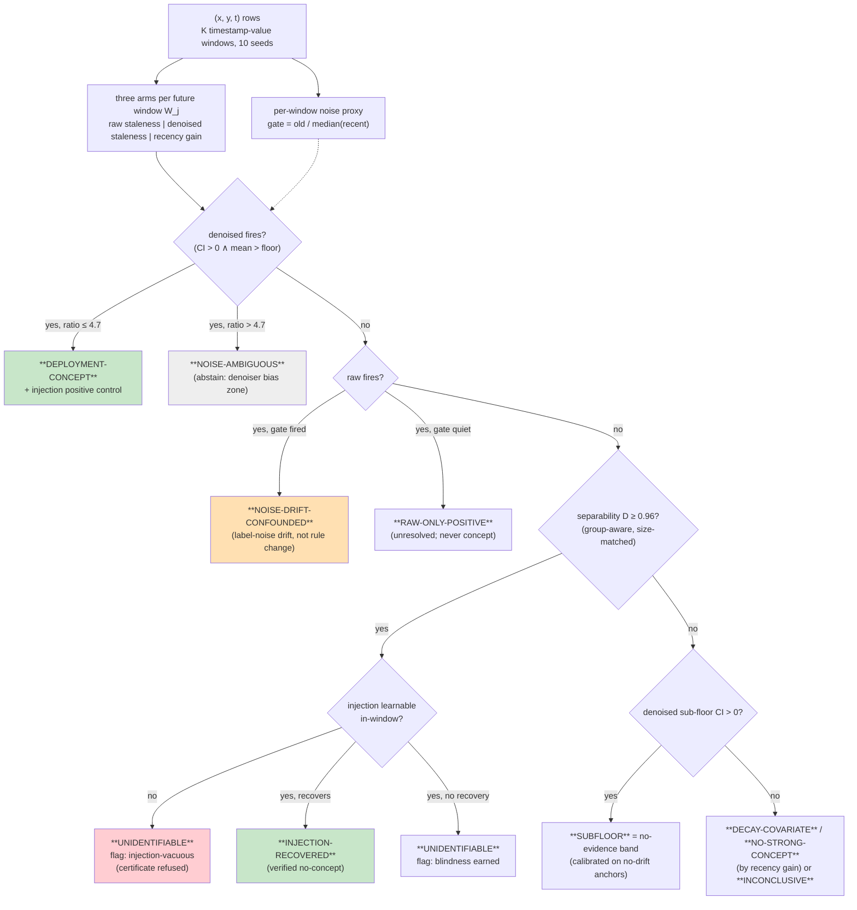

> **V5 draft, assembled 2026-08-03.** Instrument-first reframe of `PAPER_DRAFT_V4.md`, which stays
> live and unedited until this replaces it. §1, §3, §6, §7, §8 and §9 are written for V5; §2, §4, §5
> and the appendices are V4 text moved here with cross-references renumbered mechanically and three
> specified edits applied (`PAPER_DRAFT_V5_SECTIONS.md` records which). No number was re-measured.

# Label-Noise Decay Mints Concept Drift: A False-Positive Channel in Loss-Based Drift Attribution, and What a Certified Instrument Looks Like

## Abstract

A drift monitor must say what moved, not merely that something did, because a changed rule P(y|x)
calls for retraining on recent data and moving covariates under a fixed rule do not. The loss-based
comparison this attribution rests on has a false-positive channel we have not found reported
elsewhere. Hold the rule provably fixed, let only label noise decay over time, and the comparison
returns a concept-drift verdict: +0.021 against a decision floor of 0.02, and within 0.003 of the
+0.024 industrial positive our own earlier instrument had reported and we had believed. Two further
channels, built adversarially against our own repair, fire the same way under fixed rules.

We then repair the instrument. Old labels are replaced by cross-fitted predictions from inside their
own window, a per-window gate flags high label noise, and the validity envelope is measured out to
the noise level at which the repaired arm itself crosses the floor on a null. A 14-cell
pre-registered battery validates the repair, including a cell where rule change and noise decay
co-occur and the repaired arm must still fire; it does, at 58% of its clean power. Verdicts are
earned through three certificates: separability, injection, and learnability.

The repaired instrument then diagnoses the mechanism of its own earlier false positive on real
data, with the power to have seen a rule change certified in the same windows. We also measure where
it is blind, along four axes, and the last is settled from outside. Against the ACA Medicaid
expansion, a rule change documented in law, the probe read null in a fully identifiable regime and
at the tightest detectable bound in the paper, because its score is rank-based and an eligibility
threshold moves mass across a decision boundary without reordering anyone. On eight industrial
datasets (TabReD), with a fresh-seed replication that leaves 10 of 10 verdicts unchanged, it finds
no exploitable mean-rule drift above each dataset's detectable floor for the deployed tree-ensemble
class: 0/8 audited, 0/5 among the cells that carry an informative reading. A frame that does attribute shift types, run head-to-head on the same battery, separates
the two mechanisms by magnitude but not by sign, so a threshold reading files two events with
different repairs as one. We release the instrument, the battery and the audit trail, and argue that
drift-type attribution without identifiability certificates, the current default, is unreliable.

---

## 1. Introduction

A team watching a deployed tabular model sees its recent loss rise and has to choose. Retrain on
recent data only, discarding older rows as stale, which is right if the labeling rule has changed.
Or keep everything, because the rule is intact and the older rows still carry correct labels, which
is right if only the covariates moved. Choosing wrongly is expensive in both directions, and
choosing is what drift-type attribution is for.

The comparison that attribution usually rests on is simple enough to be trusted without checking:
fit a model on recent data, fit another on recent plus old data, and read the gap on a future
window. If old rows now mislead, adding them hurts. We call this quantity *staleness harm*, and it
is deployment-native in a way importance-weighted decompositions are not. The recent portion is
identical in both arms, so covariate coverage cancels by construction, and nothing needs density
ratios or overlapping supports, which is exactly what fails in industrial feature spaces.

**The comparison has a false-positive channel.** Its informal justification, that correct labels cannot
hurt, is false for finite-capacity empirical risk minimization. Hold the rule provably fixed, let
only the *noise* on the labels decay over time, and the comparison fires: unweighted ERM is not
efficient under heteroscedasticity, so noisier old rows inflate the loss of any model that fits
them, and removing them improves recent-window loss for reasons that have nothing to do with the
rule. On a constructed null this reads +0.021, above the 0.02 floor this literature's thresholds live
near and within 0.003 of +0.024, an industrial positive our own v2 instrument had reported and we
had believed. A monitor consuming that number would retrain on recent data and
throw away correct labels, while telling its owners the rule had changed. Two further channels,
constructed adversarially against our own repair, fire the same way: x-dependent noise whose scale
decays (+0.025), and noise correlated with the rule-carrying feature (+0.026), the denoiser's worst
case. Growing noise reads −0.023, so the artifact is directional rather than a constant bias.

**Two more ways the naive instrument lies**, repaired in §4.3 and mapped in §6.1 respectively. The
natural certificate for "a null here is uninformative" is a window-separability AUC, which asks
whether a classifier can tell old rows from future rows. Computed row-wise it saturates to
0.994–1.000 under exact duplicates, near-duplicates and entity cohorts with no covariate shift at
all: the classifier memorizes rows, not distributions, and
eight of ten real datasets read exactly 1.000 under the naive gate. And the concept/covariate
separation is hypothesis-class-relative: a kNN probe reads pure covariate shift as concept drift
(+0.098) and a two-layer MLP reads fixed-rule prior shift as concept drift (denoised +0.042), while
tree ensembles pass all controls. That is Shimodaira's misspecification result made empirical, and
it means "old data hurts" can be manufactured by geometry alone.

**The repair, and the discipline it needs.** Each failure gets a repair validated by execution
(§4–§5). A *denoised staleness* arm replaces old labels with cross-fitted predictions from inside
their own window: under noise-only drift those pseudo-labels are approximately correct and the harm
vanishes, while under a changed rule they still encode the old rule and the harm persists. A
per-window noise gate flags the confound, and its validity envelope is measured rather than assumed,
out to the noise level at which the denoiser itself crosses the decision floor on a null; beyond
that the instrument abstains. A group-aware separability estimate deflates memorization while
leaving honest drift intact. And learnability-gated injection controls turn "this dataset is
unmeasurable" from an assumption into a demonstration. All verdicts are scoped to the tree-ensemble class, with linear and kNN
probes carried as canaries whose false fires are reported rather than hidden.

**The instrument turned on itself.** Pointed back at the dataset that produced our prior positive,
the repaired instrument reproduces the v2 raw reading bit-for-bit, measures old-window label noise
at 2.1–2.9× the recent median, and returns a *significantly negative* denoised arm at every window
resolution: with the noise removed the old rows help. The same windows recover a rule planted at
reference strength (+0.086, learnable at R² 0.93), so the negative is certified rather than
argued. We are not aware of a prior case of a drift-attribution instrument diagnosing the
*mechanism* of its own earlier false positive on real data, as opposed to failing to replicate it.

**And its blind spots, measured.** A null is worth its blind spots, so we map ours (§6) along four
axes: probe class, separability, rule family, and metric. The last is settled from outside. The ACA
Medicaid expansion, implemented by Pennsylvania on 2015-01-01 and never adopted by Texas, is a rule
change documented in law and visible in the raw positive rates (0.234 → 0.306 against a flat
0.183–0.185). The probe read both states null, in a fully identifiable regime and at the
tightest detectable bound anywhere in this paper, so a confident zero rather than an underpowered
one. The mechanism was registered before the run: our binary score is AUC, which is rank-based, and
an eligibility threshold moves a large mass across a decision boundary without reordering anyone.
Under proper scores the same windows turn positive on the treated state (+0.021 under log-loss)
against +0.006 on the control. That localises the blindness and gives a repair direction, and §6.4
states the three things the reading does not license.

**The application.** With the instrument certified and its blind spots mapped, we spend it on the
question that motivated building it (§7): a pre-registered audit of eight TabReD datasets,
Electricity and the INSECTS streams, with confirmatory fresh-seed replication (10/10 stable). The
result is an identifiability map rather than a detection table: 0/8 audited and 0/5 among the cells
that carry an informative reading, the sole robust positive being designed drift, with two cells
refusing a certificate outright rather than counting as evidence and one already diagnosed in
§3.2. Anchor streams fix the
sensitivity profile: monotone and single-switch rule changes fire 9/9, and recurring regimes are
correctly silent with a negative-recency fingerprint that is impossible under one-way drift.

**Contributions.**

1. *A false-positive channel in loss-based drift attribution* (§3), executed rather than argued:
   label-noise decay under a provably fixed rule mints concept verdicts at magnitudes matching real
   borderline positives, with two further channels found by adversarial construction, and a
   head-to-head showing a type-attributing frame separates the mechanisms by magnitude but not by
   sign.
2. *A repaired, abstaining instrument* (§4–§5): denoised staleness with a noise gate and a measured
   validity envelope, group-aware separability, learnability-gated injection certificates,
   class-scoped verdicts with canaries, validated on a 14-cell pre-registered battery including
   the adversarial combination in which rule change and noise decay co-occur (fires at 58% of
   clean power).
3. *A measured map of an instrument's blind spots* (§6), including one settled against external
   ground truth: class relativity (a linear monitor flips the canonical Electricity dataset to
   concept drift on identical bytes), continuous power collapse inside the separability gate
   (ρ = −0.47), family relativity (a subpopulation-local rule learnable at R² 0.560 and
   unrecovered at −0.050), and metric relativity (the ACS falsification).
4. *A pre-registered identifiability map of industrial tabular ML* (§7): 0/8 audited and 0/5
   informative, one diagnosed false positive with mechanism, per-dataset certificates and
   detectable-effect bounds, 10/10 confirmatory stability and 10/10 cross-class agreement.

**What we do not claim.** We do not claim concept drift is absent from industrial tabular data:
several cells are certified *blind*, and blindness is not absence. We do not claim the
identifiability theory is new: that overlap failure blocks nonparametric identification is
classical, and class-relativity is established. Our contribution is the executed channel, the
repaired instrument, and the certified map. We do not claim model-agnosticism: every verdict is
relative to the deployed hypothesis class, which we argue is the only honest way to state
drift-type attribution at all. We do not claim the noise channel is the only way this comparison
fails, only that it is one nobody had reported and that it is large enough to have fooled us. And
we do not claim our own instrument is trustworthy everywhere. §6 is the list of places where it is
not, and one entry on that list was set by a state's policy decision rather than by us.

---

## 2. Related work

**Shift-type maps on tabular data.** WhyShift (Liu et al., 2023) is the closest prior: it
attributes performance drops to Y|X- vs X-shift across tabular datasets and concludes
Y|X-shifts are prevalent — on predominantly spatial/subpopulation axes, under an
overlap-assuming decomposition. Our delta is threefold: the *temporal* axis on deployed
industrial representations (where positivity actually fails and their lens degenerates), an
*abstention arm* with per-dataset certificates (WhyShift assumes the decomposition is
measurable), and the instrument-failure anatomy. DISDE (Cai et al., 2023) supplies the
decomposition formalism we inherit terminology from; its shared-distribution term is identified
only on common support — the boundary our map makes operational. TabReD itself (Rubachev et
al., 2025) frames everything as "gradual temporal shift" and contains no decomposition or
recency experiments; TableShift (Gardner et al., 2023) and Wild-Time (Yao et al., 2022) are
shift benchmarks without drift-type attribution.

**Identifiability and class-relativity.** That P(y|x) is not identified off-support without
assumptions is textbook positivity (D'Amour et al., 2021, for high-dimensional overlap failure;
Ben-David et al., 2010, for the learning-theoretic impossibility; Johansson et al., 2019, for
support failure inside learned representations). Hinder et al. (2023) prove
constructively that loss-based drift detection is class-relative in both directions — virtual
drift that moves the loss, real drift invisible to it — and their survey states "the used model
class is crucial." Loog et al. (2019) show ERM risk can be non-monotone in sample size even
i.i.d., closing the door on any unconditional "more correct data cannot hurt" lemma. Gower-Winter
et al. (2026) argue drift detection is ill-posed through windowing choices. We treat all of this
as settled theory that the applied drift-monitoring stack has not absorbed, and contribute the
executed demonstration + the repaired protocol; we state no theorems of our own — where the
paper sounds formal (the envelope, the certificates), the content is a measured boundary, not a
proved one.

**Old data harming.** Shimodaira (2000) is the mechanism for the misspecified case; the Data
Addition Dilemma (Shen et al., 2024) documents mixture harm empirically in clinical ML;
Klinkenberg & Joachims (2000) use held-out error over candidate training windows to *adapt*
window size. We are not aware of prior work that uses the add-old-data contrast as a
drift-*type* identifier with verdict semantics, or that reports the label-noise-decay
false-positive channel — under the field-standard definition of real drift as any change in
P(y|x) (Gama et al., 2014; Webb et al., 2016), noise drift *is* drift, which is precisely why an
instrument that claims to detect *exploitable rule change* must separate the two; we separate them
by construction (§3.1), validate the separation adversarially, and measure how far the confusion
reaches into a type-attributing frame that is not ours (§3.4).

**Pseudo-labels, denoising, cross-fitting.** The denoised arm's mechanics are deliberately
borrowed: replacing labels with model predictions is self-training (Scudder, 1965; Lee, 2013)
and distillation (Hinton et al., 2015); the view of noisy labels as recoverable by a fitted
model underlies noisy-label learning (Natarajan et al., 2013; Han et al., 2018); strictly
out-of-fold prediction to avoid own-fit contamination is cross-fitting (Chernozhukov et al.,
2018). What we take from these literatures is the estimator; the *use* — as the discriminating
arm of a drift-type verdict, with an adversarially mapped validity envelope and an abstention
rule — is the contribution we claim, and we scope it to its evidence: none of these adjacent
literatures, to our reading, reports the failure channel this arm exists to defuse.

**Drift detectors and their evaluation.** Classical detectors (surveys: Gama et al., 2014; Lu et
al., 2019) monitor loss or distribution statistics and are evaluated by injecting known drifts
into streams (Poenaru-Olaru et al., 2022); Detectron (Ginsberg et al., 2023) defines harmful
shift model-relatively. Our injection control differs in role: it is an *in-situ, per-dataset
power certificate* (planted in the real covariate geometry, learnability-gated), used to
distinguish earned blindness from instrument vacuity — a distinction we show matters on real
data: of the four industrial "unidentifiable" cells, two never earn a certificate at all
(the planted rule is unlearnable in their geometry under every signal family we tried) and the
other two are settled only by widening the family beyond the reference one. We do not run
these detectors head-to-head on the audited cells: a loss-stream detector answers "did anything
change?" and is type-blind by construction, so its fires would not bear on drift-*type*
attribution, and we measure that rather than only asserting it: run over the battery's
prequential error streams, four standard detectors fire at rates that do not track the ground truth
at all — a true rule change firing at exactly the stationary cell's rate while a fixed-rule
covariate shift fires, and a pure stationary regression cell firing level with both (Appendix B.7).
Frames that *do* attribute types are a different matter, and we run one head-to-head on battery
cells whose ground truth is fixed by construction (§3.4): it separates rule change from noise decay
by magnitude but not by sign. The canary panel (§6.1) is the
like-for-like comparison within our own instrument — what a weaker *attribution* probe reports
on the same bytes — and porting the certificate protocol to streaming monitors is future
work (§8).

**Malware.** TESSERACT (Pendlebury et al., 2019) established temporally honest evaluation in
malware and documents performance decay. Our EMBER read (old data *helps*; staleness −0.008;
detectable floor 0.0013) refines rather than contradicts it: the decay is coverage-driven (new
families appear — covariate expansion), not label rot (a 2017 malware sample is still malware),
which is exactly the distinction a deployment lens should draw.

---

## 3. The failure channel

### 3.1 Label-noise decay mints concept drift

The question a drift monitor is asked in deployment is not "did the distribution move" but "did
the *rule* move" — because the two answers imply different repairs. Retrain-on-recent is the
remedy for a rule change; it is a mistake when the rule is fixed, since it discards data that is
still valid. Loss-based attribution answers that question with a comparison: a model fit on recent
data versus one fit on recent plus old data, the gap read as evidence that the old rows now
mislead. The comparison has a false-positive channel that, to our knowledge, has not been
reported.

Hold the rule provably fixed and let only the *label noise* decay — early labels noisier than
late ones, the mapping from x to the true label unchanged throughout — and the comparison fires.
On a constructed null of 12,000 rows the raw arm reads +0.021, above the 0.02 decision floor
this literature's thresholds live near. That magnitude is not an abstraction: it lands within
0.003 of +0.024, the industrial concept positive our own earlier instrument had reported and
we had believed (§3.2). A monitor consuming that reading would retrain on recent data, discarding
correct labels, and would attribute a rule change to a dataset whose rule never moved.

The channel is not a single trick. Adversarial construction against the repair itself found two
more: noise whose *scale depends on x* while decaying (raw +0.025), and — from an independent
red-team pass, the denoiser's worst case, since pseudo-label error then concentrates exactly where
the signal lives — noise scale correlated with the rule-carrying feature (raw +0.026). All
three fire on the raw arm; all three have a provably fixed rule. The mechanism is elementary once
stated: noisier old labels inflate the loss of any model that fits them, so *removing* old rows
improves recent-window loss for a reason that has nothing to do with the rule. What makes it
dangerous is that the resulting number is indistinguishable, in both sign and magnitude, from the
thing practitioners act on.

Symmetry check: label noise *growing* over time reads −0.023 — old rows appear to help — so
this is a directional artifact of noise trajectory, not a constant bias.

### 3.2 The instrument diagnoses its own prior positive on real data

Our v2 instrument (raw arm only) reported sberbank-housing, the panel's one regression dataset, as
its sole industrial concept positive: +0.024 [+0.018, +0.030]. The constructed null of §3.1
was built at matching magnitude, and the repaired instrument was then pointed back at the real
dataset.

Across window resolutions K ∈ {5, 8, 10, 12, 20} the raw arm fires at K ∈ {8, 10, 12}, at K = 10
reproducing the v2 headline bit-for-bit (+0.0239; the raw pipeline's RNG stream is unchanged,
so this is the same signal reinterpreted, not a re-measurement that happened to differ). The old
window's measured noise proxy runs 2.1–2.9× the recent median at every K. And the denoised arm
— old labels replaced by cross-fitted pseudo-labels — is significantly negative at every K
(−0.014 to −0.018, all CIs below zero): with the noise removed, the old rows *help*. The rule did
not change; the early labels are noisier, consistent with 2011–2012 crisis-era Russian housing
prices.

A negative result of this shape invites one objection: that the windows simply lack power. They do
not, and we certify rather than argue it. Under the strict decision rule the cell reaches the
injection control, where a rule planted at reference strength is learnable in this geometry
(in-window R² 0.93) and recovers at +0.086; at K = 20 a planted rule recovers +0.101
through the same geometry. The same windows that fail to show a rule change do show a rule change
that was put there. The diagnosis is of the minted positive only: a residual rule change *below*
the floor, co-occurring with the noise decay, is not excluded, and we claim nothing sub-floor in
either direction.

We are not aware of a prior case of a drift-attribution instrument diagnosing the *mechanism* of
its own earlier false positive on real data, as opposed to failing to replicate it.

### 3.3 Why a noise gate is not the repair

The obvious fix — measure the noise trajectory, refuse a verdict when old-window noise is high —
is necessary and insufficient, and the battery says so by construction. In the cell where a
rotating rule and decaying noise co-occur, the noise gate fires (ratio 3.67) while the rule
genuinely moved; a gate with veto power would suppress a true positive. The instrument therefore
gates and denoises separately: the denoised arm still reads +0.316 there, 58% of the clean
rotating-rule signal (+0.541), and retention holds at small magnitudes (a 0.8-rad rotation: clean
+0.108, with noise decay +0.062 — attenuated, still firing). The gate flags the confound; only the
denoised arm decides.

Denoising is itself biased — pseudo-label error grows with old-window noise — so its validity
boundary is measured rather than assumed. On pure fixed-rule nulls the denoised arm reads +0.0037
at noise ratio 3.54, +0.0048 at 3.76, +0.0043 at 3.87, +0.0140 at 4.72, and +0.0259 at 5.71 —
across the decision floor, on a null. Above ratio 4.7 the instrument abstains. Separation still
exists beyond it (at ratio ≈6 a true rotation reads +0.086 against the null's +0.026, disjoint
CIs), but a threshold there would rest on a single noise family, so we refuse the verdict instead
of calibrating one. Abstention is a measured envelope, not a disclaimer.

### 3.4 Does the channel reach the frames practitioners actually use?

The sections above measure our own probe. The obvious objection is that a field tool built on a
different principle — reweighting-based decomposition of the shift into X-side and Y|X-side terms
— would not be fooled. We pointed such a frame at battery cells whose ground truth is fixed by
construction, under conditions favourable to it (covariate overlap intact, cov-AUC 0.500, effective
sample size 71.3% after reweighting).

**Table 1.** A reweighting-based frame on battery cells whose ground truth is fixed by construction. It separates rule change from noise decay by magnitude but not by sign.
| cell | truth | Y\|X-side gap |
|---|---|---|
| rotating rule (binary) | rule moved | **+0.4345** |
| rotating rule (regression) | rule moved | **+0.8207** |
| label-noise decay, fixed rule | rule fixed | +0.0576 |
| x-dependent noise decay, fixed rule | rule fixed | +0.0615 |
| stationary (regression) | rule fixed, no noise trend | −0.0208 |

The strong version of our claim is refuted by this, and we say so: the frame does separate the
two mechanisms by magnitude, 7.5–14× — a practitioner reading the number, not the label, is not
misled. What survives is narrower and still costly. Sign does not separate. Both noise-decay
cells return a *positive* Y|X-side gap where the true stationary cell returns a negative one, so
under the field-standard definition (Webb et al.; Gama et al.) — under which noise decay *is* a
Y|X change — a threshold reading files both as the same event. The two events have different
repairs: retrain-on-recent is right for one and discards valid labels in the other. Attribution by
sign or by threshold is what fails; attribution by calibrated magnitude, against a null of the kind
built in §3.1, is what a monitor would need.

---

## 4. The repaired instrument

**Figure 1.** The decision cascade (mermaid draft below; vector figure =
`paper/figures/fig1_cascade.tex`, compiled & verified). The
cascade is specified verbatim in §4.4 and PREREG §3.

Side channels drawn as annotations in the final figure: the strict-rule shadow verdict
(rule-sensitive flag), the negative-recency fingerprint for recurring regimes (§7.3), the
canary-probe panel (§6.1), and provenance stamping on every run.

*Reading aid.* The cell of §3.2 exercises most of the vocabulary below. On sberbank-housing,
the raw arm fires (+0.024) but the noise gate is on (2.1×) and the denoised arm is
negative — so the cascade returns NOISE-DRIFT-CONFOUNDED rather than concept; had all three
aligned inside the envelope, the verdict would have been DEPLOYMENT-CONCEPT, subject to an
injection positive control.

**Terminology (one line each).**

**Table 2.** Terminology, one line each.
| term | meaning |
|---|---|
| raw staleness | future-window score(recent) − score(recent ∪ old); >0 = old data hurts |
| denoised staleness | same, with old labels replaced by cross-fitted within-old-window predictions; >0 = the *rule* changed |
| noise gate | old-window noise proxy / recent median; >1.5 = label-noise drift present |
| envelope | noise-ratio 4.7, the measured boundary of denoiser validity; above it the instrument abstains |
| D | window-separability AUC (group-aware, size-matched); a routing statistic, *not* support overlap |
| injection | a known rule rotation planted in the dataset's own geometry; the per-dataset power certificate |
| earned blindness | injection learnable in-window yet unrecoverable → the geometry genuinely hides this signal class |
| injection-vacuous | injection unlearnable → the null certifies nothing |
| no-evidence band | sub-floor CI-positive readings; calibrated on no-drift anchors as noise |
| canary probe | a deliberately misspecified probe class (linear/kNN) whose false fires are reported |
| rule-sensitive | verdict differs between the primary and strict decision rules; barred from headlines |

### 4.1 Setting and estimand

Rows (x_i, y_i, t_i) arrive over time; the auditor sees the full labeled history (retrospective
audit, not online prediction). Fix K windows by timestamp-value rank (ties never straddle
boundaries; per-seed boundary jitter). For each future window W_j (back half), with old anchor
W_0 (earliest window with ≥200 rows and a trainable label set) and recent window W_{j−1}, draw
size-matched samples (N = min(|recent|, |old|, 6000)) and train three models of the deployed
class: recent-only, old-only, recent∪old. Report per-seed means over future windows of

- **decay** = score(old model, held-out W_0) − score(old model, W_j) — aging, mechanism-blind
  (documented at scale by Vela et al., 2022);
- recency gain = score(recent) − score(old) on W_j — adaptation value, conflates coverage
  and rule change; *its sign is itself diagnostic (§7.3): negative recency is impossible under
  one-way drift and fingerprints recurring regimes*;
- raw staleness = score(recent) − score(recent∪old) on W_j — the attribution probe;
- denoised staleness = score(recent) − score(recent ∪ (X_old, ĝ_old(X_old))) on W_j, where
  ĝ_old is a 2-fold cross-fitted model *within* W_0 producing strictly out-of-fold hard
  pseudo-labels.

Scores: AUC (binary), accuracy (multiclass), −RMSE on z-scored targets (regression). CIs are
Student-t over 10 seeds; each seed re-draws a 90% row subsample, re-jitters window boundaries,
and re-samples all training sets. These are seed-level intervals over heavily overlapping
subsamples and are anti-conservative for tiny effects (§7.3 calibrates the resulting no-evidence
band on no-drift anchors); verdict-level inference does not rest on them alone — the
confirmatory fresh-seed replication (§7.1) is the operative stability check, and per-seed values
are emitted with every run so that alternative constructions (window-block bootstrap, split-half)
can be applied without re-execution. The pre-registered estimand is *exploitable mean-rule drift*:
a change in the decision-relevant functional of P(y|x) that makes old labels contradict the
current rule for the deployed hypothesis class. This is deliberately narrower than the
field-standard "any change in P(y|x)" (Moreno-Torres et al., 2012; Webb et al., 2016) — the
narrowing is the point, because
the wider definition classifies label-noise drift as concept and thereby licenses retraining
that cannot help.

### 4.2 The denoised arm and the noise gate

**Why the denoised arm separates rule change from noise drift.** Under noise-only drift the
conditional mean/Bayes rule is unchanged, so ĝ_old estimates the *same* rule from noisy labels;
its pseudo-labels are approximately correct denoised labels, and adding (X_old, ĝ_old(X_old))
to the recent set has no remaining mechanism to hurt through (an expectation whose boundary
§3.3 measures, not a theorem) — executed: the +0.021 noise-decay false positive
collapses to +0.004 while the gate (below) flags the mechanism. Under genuine rule change,
ĝ_old consistently estimates the *old* rule; its pseudo-labels still contradict the current
rule, and the harm persists — executed: a rotating-rule stream keeps +0.541 of its +0.546 raw
signal, and rule-change-plus-noise-decay still fires at +0.316. The denoiser is not unbiased:
its pseudo-label error grows with old-window noise, and we *mapped the boundary* — at an
old/recent noise ratio ≈5.7 the denoised arm itself crosses the decision floor on a pure null
(+0.026). The instrument therefore carries an envelope constant (abstain above ratio 4.7) rather
than a pretense of a theorem; per Loog et al. (2019), no unconditional soundness lemma exists to
be had.

**The noise gate.** Per window, a fresh model of the deployed class is fit on 70% and its
held-out irreducible-error proxy recorded (regression: MSE on z-scored y; binary: 1−AUC;
multiclass: 1−accuracy). The gate statistic is old-window proxy / median recent-window proxy;
it fires above 1.5 (stable synthetic controls calibrate at 0.75–0.99) and defines the envelope
above 4.7. The gate alone is *not* a sufficient repair — a gate-veto rule would misfile genuine
rule change co-occurring with noise drift (executed: +0.316 must fire despite gate 3.67) — it
supplies the *mechanism label* (NOISE-DRIFT-CONFOUNDED) when the raw arm fires and the denoised
arm does not.

### 4.3 Certificates: separability, injection, learnability

**Window separability D (not "overlap").** D is the median held-out AUC of a classifier
separating W_0 from each back-half window, on the proxy-stripped feature space, with two
repairs over the naive version: size-matching by *random subsample* (a head-slice on
time-sorted rows manufactures separability from window-size imbalance — executed: shuffle-D
0.94 with no static feature, collapsing to 0.50 under the fix) and a *group-aware* train/test
split keyed on near-duplicate clusters (z-scored rows rounded to 0.1): exact duplicates at
multiplicity 5 inflate row-split D to 0.994 and entity cohorts to 1.000 with zero covariate
shift; the group split returns both to ≈0.50 while honest drift keeps D high. We report D as
*separability*, never as support overlap: a single genuinely predictive drifting feature
saturates it, so D ≥ D* = 0.96 routes a staleness null to the injection control rather than
concluding anything by itself.

**Learnability-gated injection.** For any candidate-unidentifiable dataset (and, as a positive
control, for any CONCEPT verdict), a reference concept — a rule rotation of fixed strength on
the two highest-variance features — is planted in the dataset's own (X, t) geometry and the full
staleness pipeline re-run (10 seeds, same power as the main read). Before the null is allowed to
mean anything, the injected rule must be *learnable in-window* (held-out AUC ≥ 0.65 / R² ≥ 0.20
/ accuracy ≥ majority + 0.10): executed on a constructed geometry whose top-variance features
are heavy-tailed junk, the injected rule is unlearnable (in-window AUC 0.482) and the naive
protocol grants "earned blindness" vacuously; the gate converts that to *injection-vacuous* —
certificate refused. Outcomes: recovery (⇒ the real null was informative: verified no-concept),
earned blindness (learnable but unrecoverable ⇒ the geometry genuinely hides this signal
class), or vacuity (no certificate). On the real audit, this distinction is load-bearing: of
the four "unidentifiable" industrial cells, two fail the learnability gate under every signal
family we tried and end with no certificate; the other two only resolve once the family is
widened — homesite_insurance scores within 0.05 of the gate on the reference family and flips
across seed sets, but is comfortably learnable and consistently unrecovered on the low-variance
one, and weather is unlearnable on the reference family yet recovers on two others (§7.2). The certificate is explicitly
relative to this reference family: recovery certifies power against rotations carried by the
dataset's high-variance directions, not against rule changes living in low-variance features,
interactions, or subpopulations (§6.3, where the sweep that measured this is reported).

**The identification boundary (restatement of prior work, not a new result).** Let R be the
region of covariate space the future windows occupy and the old anchor does not. On R, P(y|x) is
not nonparametrically identified from the observed windows: two conditionals that agree on the
old window's support and differ on R induce identical observable data, because no old rows fall
in R. This is the time-axis instance of the shared-support requirement that DISDE makes explicit
(Cai et al., 2023, Prop. 1), and we claim no theorem of our own. Three properties of the
instrument follow from it rather than from convenience. Abstention is *correctness*, not
timidity. D is a routing statistic for how close a panel sits to that boundary, and never a
measure of support overlap itself — which is why D ≥ D\* concludes nothing on its own and hands
off to the injection control. And a cell without an identifiability certificate cannot be
evidence of *no drift*; it is only evidence of *no measurement*, which is why we carry the 0/5
certified count alongside the pre-registered 0/8 (§7.2). In the opposite direction —
*soundness*, i.e. staleness > 0 implying rule change — no theorem is available to be had: Loog
et al. (2019) show ERM risk is non-monotone in added same-distribution data, so E[staleness] > 0
is possible under zero drift and zero heteroscedasticity. That asymmetry is why §3.3 reports a
*measured* validity envelope where a soundness lemma would otherwise go.

### 4.4 Decision cascade and scope

The pre-registered cascade (PREREG §3; verbatim in the artifact): DEPLOYMENT-CONCEPT requires
the *denoised* arm to fire (CI lower bound > 0 and mean > 0.02) within the noise envelope; a raw
fire with the gate on is NOISE-DRIFT-CONFOUNDED; a raw fire with the gate off is
RAW-ONLY-POSITIVE (unresolved, never concept); nulls route through D to the injection
certificates; a sub-floor denoised CI is reported as a no-evidence band (calibrated: 2/5 no-drift
anchor streams land there at 1/10–1/20 of the floor — CI-significant, decision-irrelevant). A
strict secondary rule (CI lower bound > floor) is computed alongside; any cell whose verdict
differs between the two readings is marked rule-sensitive and barred from headlines. Every
verdict is scoped to the deployed hypothesis class: the ground-truth suite passes under HGB and
random forests and fails under linear/kNN probes (§5), so tree-ensemble verdicts are
decision-grade and linear/kNN run as canaries. All runs emit provenance metadata (commit, argv,
library versions, seeds) into versioned artifacts; the decision rules, thresholds, seed
protocol (exploratory 0–9, confirmatory 100–109), and aggregate reading were committed before
the runs they govern. Appendix C tabulates every decision constant with its calibration source
and validity range.

---

## 5. Validation: the battery and the gate discipline

### 5.1 The 14-cell pre-registered battery

The instrument must pass a synthetic ground-truth battery before any real-data run (PREREG §4).
The battery is the entry gate, and the cells that carry the paper's argument — noise decay under
a fixed rule, x-dependent noise, rule change and noise decay co-occurring — are read in §3;
here they are the evidence that the instrument earns its verdicts. All cells: n = 12,000, d = 10,
K = 10, 5 seeds (vs ten on real data — the planted effects are 10–27× the decision floor and
the battery is a pass/fail gate, not an estimation exercise); verdicts under the full cascade.

**Table 3.** The 14-cell pre-registered battery: ground truth, both staleness arms, the noise gate, and the verdict the cascade returns.
| cell (truth) | raw | denoised | gate | verdict |
|---|---|---|---|---|
| rotating rule (binary) | +0.280 | +0.289 | 0.90 | **CONCEPT** ✓ |
| rotating rule + drifting nuisance | +0.203 | +0.206 | 1.18 | **CONCEPT** ✓ (proxy-stripped) |
| rotating rule (regression) | +0.546 | +0.541 | 0.91 | **CONCEPT** ✓ |
| **rotating rule + noise decay** | +0.357 | **+0.316** | 3.67 (fires) | **CONCEPT** ✓ — the gate must not veto |
| covariate shift, fixed rule | −0.001 | −0.000 | 0.74 | UNIDENT (blindness earned) ✓ |
| stationary | −0.001 | −0.000 | 0.75 | NO-STRONG-CONCEPT ✓ |
| prior shift, fixed rule (multiclass) | −0.003 | −0.004 | 0.84 | UNIDENT, injection-vacuous ✓ |
| mild covariate shift (D = 0.73, un-gated) | −0.003 | +0.001 | 0.99 | NO-STRONG-CONCEPT ✓ — the null is load-bearing, not gated away |
| stationary (regression) | −0.012 | −0.002 | 0.99 | NO-STRONG-CONCEPT ✓ |
| covariate shift, fixed *linear* rule (reg.) | +0.002 | +0.004 | 0.91 | UNIDENT ✓ (never CONCEPT) |
| covariate shift, fixed *nonlinear* rule (reg.) | −0.005 | −0.003 | 0.92 | UNIDENT ✓ |
| **label-noise decay, fixed rule** (the F1 killer) | **+0.021 fires** | +0.004 | 3.54 | **NOISE-DRIFT-CONFOUNDED** ✓ |
| label noise *growing*, fixed rule | −0.023 | −0.019 | 0.14 | NO-STRONG-CONCEPT ✓ |
| **x-dependent noise, decaying scale** | **+0.025 fires** | +0.005 | 3.76 | **NOISE-DRIFT-CONFOUNDED** ✓ |

The three cells that carry the paper's argument — noise decay under a fixed rule, its x-dependent
variant, and rule change co-occurring with noise decay — are read in §3 and not re-argued here.
What the battery adds is the surrounding discipline: every other row is a control whose truth is
fixed by construction, and the instrument must return the right verdict on all fourteen before it
touches real data. Two readings in Table 3 appear nowhere else. The *third* noise channel — noise
scale correlated with the rule-carrying feature, the denoiser's worst case, constructed by an
independent red-team pass — fires the raw arm at +0.026 and is defused by the denoised arm at
+0.006. And the denoiser's robustness to a small old window was checked directly (old window capped
at 600 rows, cross-fit folds of 300): no false positive (+0.004) and no false negative (+0.429).

**Floor comparability across metrics.** The 0.02 decision floor is shared across AUC, accuracy,
and z-scored −RMSE, which are not decision-equivalent units. Two mitigations are structural:
every null carries its own detectable-effect bound δ (the per-dataset, per-metric power
statement that does the aggregate's real work), and CONCEPT never rests on the floor alone (the
denoised CI, gate, and envelope must all align). As a sensitivity check, re-thresholding all
committed runs under per-metric floors rescaled by the battery's matched-strength concept
magnitudes (binary +0.28 vs regression +0.55 ⇒ regression floor 0.04) moves no cell across the
concept/no-concept boundary; the only affected cell is the mechanism label of the diagnosed
regression positive (§3.2), which is already flagged rule-sensitive and barred from headlines.

### 5.2 The gate has teeth: re-gating after the instrument changes

The battery is not run once. It is the re-gate that any change to the instrument must pass, and the
rule committed with it is that a mismatch reverts the change rather than explaining it. That rule
has now been exercised after the fact: when two opt-in diagnostic flags were added to the probe, the
battery was re-run and required to return bit-identical results against the reference
environment — all fourteen cells, every field, verdicts included. It did. A pre-registered
instrument means little if its gate cannot fail once the code is already written; this is the record
that it can.

---

## 6. Where the instrument is blind

Sections 4 and 5 establish what the repaired instrument can say. This section establishes what it
cannot, along four axes, each measured rather than asserted. Three are measured with our own
tools; the fourth is settled from outside, against a rule change documented in law.

We put this before the application (§7) deliberately. A verdict of "no rule change" is only worth
its blind spots, and a reader who does not know them cannot price the map that follows.

### 6.1 Class relativity: the same bytes, a different probe, a different verdict

Every component of the instrument — both staleness arms, the noise gate, separability, the
injection control — follows the probe's model class. Swapping that class through the five core
controls separates two properties that are usually conflated. Concept *detection* is class-robust:
all five classes fire on a true rotation (+0.280 to +0.310). Concept/covariate *separation* — the
property a verdict actually rests on — is not. kNN reads pure covariate shift with a fixed rule as
concept (+0.098); on fixed-rule prior shift, kNN (+0.048), linear (+0.026) and a two-layer MLP
(denoised +0.042) all false-fire. This is Shimodaira (2000) made empirical: under misspecification
the mixture-ERM optimum moves with P(x), so covariate shift alone manufactures "old data hurts."
Denoising does not repair it — kNN still false-fires at +0.111 on pseudo-labels, because the
misspecification is in the probe, not in the labels.

The neural result deserves its own sentence, because the field's motivating question is whether
deep tabular models have a rule change to exploit: the first neural probe we tested fails the
separation battery and is therefore carried as a canary, not as decision grade. We do not
extrapolate that to modern deep architectures at production scale; we claim the direction of the
burden — a probe class earns drift-verdict authority by passing this battery.

On real data the consequence is not hypothetical. Electricity — the literature's canonical
concept-drift dataset — reads DEPLOYMENT-CONCEPT under two independent canary classes (linear:
raw +0.023, denoised +0.033, injection recovers +0.190; MLP: raw +0.007, denoised +0.025) and
unidentifiable-with-earned-blindness under the tree-ensemble probe, on identical bytes. Whether a
monitor confirms that dataset's reputation is a property of the monitor. A second canary behaviour
is worth reporting as a warning: on ecom_offers the linear probe fires the *denoised* arm alone
(+0.028) with the raw arm null (−0.002) — a denoiser artifact specific to misspecified probes,
since the linear ĝ_old's systematic error is itself informative to the linear downstream model.
The denoised arm's semantics are class-scoped too.

### 6.2 Power collapses continuously inside the separability gate

The separability threshold D\* = 0.96 routes cells to the injection control, and it reads as a
cliff. It is not one. Just inside it, a planted rule of *fixed* strength recovers at wildly
different magnitudes: cooking_time (D = 0.966) +0.546, delivery_eta (D = 0.999) +0.332,
Electricity (D = 1.000) +0.018, homesite_insurance (D = 1.000) −0.052.

Learnability does not explain the ordering — Electricity's planted rule is the *most* learnable in
the panel (in-window AUC 0.976) and still barely recovers. What decays across D is recovery, not
learnability. Over every learnable injection run at decision grade, the rank correlation between D
and recovery is ρ = −0.47 (p = 0.037, n = 20), and the cleanest contrast is within a single
dataset: Electricity's identical planted rule recovers +0.190 at D = 0.905 under the linear
probe, ten times its recovery at D = 1.000. A certificate therefore certifies that the geometry
had power *at this separability* — not that power is uniform across certified cells.

We tried to convert that correlation into a controlled ladder and could not, which is worth
reporting because the failure is informative. Narrowing a single cell's representation
(mutual-information top-k, k ∈ {5, 10, 20, 50}) moves D monotonically while holding dataset and
probe fixed — delivery_eta 0.521 → 0.540 → 0.555 → 0.801, homecredit_default 0.721 → 0.796 →
0.833 → 0.912, against 0.999 and 1.000 at full representation. But the narrowed cells fall
*below* the routing threshold, so the injection control never runs and there is no recovery to
read: the handle that moves D also moves the cell out of the region where power is measured. The
within-cell recovery ladder therefore remains unmeasured, and we state the correlation as a
correlation. (Registered predictions, for the record: D was predicted to fall with k and rises;
the recovery prediction was unmeasurable for the reason just given.)

Two things the ladder did show. The denoised reading itself moves with representation on a fixed
cell (delivery_eta −0.002 → −0.013; homecredit_default +0.013 [+0.010, +0.016] at k = 5, where
D = 0.721 puts it in the identifiable region, decaying to −0.010 at k = 50) — so representation
choice sets both whether a cell is identifiable *and* the sign of what is read there. And in the
adjacent low-D regime the picture is the opposite of the high-D panel: at D ≈ 0.49 on the river
anchors, all four signal families recover (+0.076 to +0.238, all learnable at 0.916–0.968),
including the subpopulation-local family that fails at high D in §6.3. Representation dependence
is a known hazard for this literature's estimands; here it is a measured one.

### 6.3 Family relativity: the certificate is relative to the class of rule change

An injection certificate says the geometry could carry *a* planted rule. It cannot say the
geometry could carry *any* rule, and the difference is measurable. Sweeping the injection across
signal families on the same windows: on weather's full deployment span, a low-variance rotation
recovers +0.128 and an interaction-borne rule recovers +0.046, both clearing the strict
rule — while a subpopulation-local rule, comfortably learnable in-window at R² 0.560 (the
gate is 0.20), fails to recover at −0.050, reproducing on confirmatory seeds (R² 0.523,
−0.042).

That combination is the point. Learnability and recoverability come apart: the instrument has
power against changes in feature *direction* and none against changes in subpopulation
*membership*, in the same geometry, at the same strength.

The blind spot is a property of family *and* geometry rather than of the family alone, and an
anchor sweep pins that down: on the single-switch river anchors, where separability is low
(D ≈ 0.49), the subpopulation-local family recovers on all three anchors (+0.119, +0.079, +0.076,
learnable at 0.937–0.963), as do the other three (+0.135 to +0.238). It is also, consistently, the
*smallest* recovery of the four — the family that falls off first as separability rises, and the
one that has already fallen off in the high-D industrial geometry. So the scope of a certificate is
a joint statement about which rule families were tested and at what separability, and §7 reports
both. Every "verified no-concept" in this
paper therefore carries an explicit family denominator, and the two certificates that stand on the
industrial panel (weather, homesite_insurance) stand against the families actually tested — weather
recovering +0.183 / +0.193 on fresh seeds under the low-variance carrier and +0.083 / +0.078 under
the interaction family.

### 6.4 Metric relativity: falsified against an externally documented rule change

The three axes above are the instrument measured with the instrument. This one is settled from
outside, and it is the sharpest thing we can say about our own tool.

The ACA Medicaid expansion is a rule change documented in law: Pennsylvania implemented it on
2015-01-01, Texas never adopted it. On the ACS public-coverage task over 2014–2018 the effect is
visible in the raw data — Pennsylvania's positive rate moves 0.234 → 0.268 → 0.293 → 0.305 →
0.306 with the step at the implementation year, while Texas stays within 0.183–0.185 throughout.

**The probe read both states null.** Pennsylvania: D = 0.534 — fully identifiable, not a gated
abstention — gate 0.91, raw −0.011 [−0.011, −0.010], denoised −0.009 [−0.010, −0.008]. Texas:
D = 0.523, raw −0.015, denoised −0.011. And the Pennsylvania null carries the tightest
detectable bound anywhere in this paper (δ = 0.00083), so this is a confident zero rather than an
underpowered one — which makes the miss sharper, not softer.

The mechanism was registered before the run and is confirmed by it. Our binary score is AUC, which
is rank-based, and an eligibility threshold can move a large mass of people across a decision
boundary without reordering anyone. Measured on the same rows with proper scores, the
treatment-versus-control separation widens from 3.1× under AUC to 6.3× under Brier, 6.6× under
log-loss and 15× under a rule-movement divergence. But it does not become large: every reading
stays below the decision floors of both instruments, and the control state also returns
placebo-significant gaps, so only the treatment/control *ratio* is interpretable. The honest
statement is therefore not "the metric explains the miss" but "the metric compresses the signal
six- to sevenfold, and even uncompressed this policy change sits under our floor."

Two consequences, and we take both. Every null in §7 is scoped to a rank-based score — the right
scope for a ranking or triage system, the wrong one for the fixed-threshold eligibility systems
this very task represents. And the 0.02 decision floor, calibrated on planted effects and no-drift
anchors, is larger than a real population-scale policy rule change. We record that as a
measured criticism of the constant (Appendix C) and do not act on it: changing a pre-registered
threshold after seeing results is precisely what this paper argues against.

The scope statement is fixed and we hold to it (`PREREG_ACS_EXTENSION` §6(b)): the finding is not
"there is no drift in ACS" but "this instrument does not see a real rule change of this size."
We do not reinterpret it as a property of the data after the fact.

**The blind spot is localised, and the repair direction is measurable.** Re-running the probe
itself under proper scores — diagnostic only, since changing the score changes the estimand and
voids the AUC-calibrated floor, so the reading rule fixed before execution discards the verdict
label and reads arm magnitudes and the PA-versus-TX contrast — flips the sign of the Pennsylvania
reading:

**Table 4.** The ACS public-coverage cells under three scores. Diagnostic only: changing the score changes the estimand and voids the AUC-calibrated floor.
| state | AUC (raw / denoised) | Brier | log-loss |
|---|---|---|---|
| Pennsylvania (expanded) | −0.011 / −0.009 | −0.005 / **+0.002** | −0.018 / **+0.021** |
| Texas (never adopted) | −0.015 / −0.011 | −0.005 / −0.002 | −0.023 / **+0.006** |

The denoised arm turns positive under both proper scores on the treatment state, reaching +0.021 —
the size of the decision floor — under log-loss, against +0.006 on the control, a 3.5× contrast in
the right direction. The raw arm stays negative under every metric. So the mechanism registered
before the run is confirmed on the instrument itself and not only through the external lens: what
the probe could not see, it could not see *because of the score*.

Three things this does not license, all of which we state rather than absorb. The proper-score arm
carries no certificate — the injection planted in that run is unlearnable (learnability −0.185),
so this reading has no power guarantee behind it. The control state also moves positive under
log-loss (+0.006), so only the ratio is interpretable, never the absolute value; the honest summary
of §6.4 remains that the metric compresses the signal six- to sevenfold and the residue still sits
under the floor. And +0.021 "clearing 0.02" compares against a constant calibrated in AUC units,
which is not a verdict; we record it and leave the constant alone.

The scope sentence therefore gains a clause and loses none of its force: not "there is no drift in
ACS", but "this instrument does not see a real rule change of this size through a rank-based
score; through log-loss it sees something floor-sized, uncertified, and shared with its control."

---

## 7. Application: auditing an industrial panel

Everything above is about an instrument. This section spends it on the question that motivated
building one: does industrial tabular data contain rule change a deployed model could exploit?
The answer is a map, and the map is worth exactly what §6 says it is worth — every number below is
scoped to a tree-ensemble probe class (§6.1), to the separability at which its certificate was
earned (§6.2), to the rule families that certificate was tested against (§6.3), and to a
rank-based score (§6.4). We state the qualifiers with the result rather than after it.

### 7.1 Protocol and result

Eight TabReD datasets (Rubachev et al., 2025; train segments of the official temporal splits),
Electricity, and INSECTS (incremental-balanced) — HGB probe, K = 10, ten exploratory seeds (0–9),
then a confirmatory rerun with fresh seeds (100–109); any verdict that moves between the two is
reported unstable and barred from claims. The decision cascade, thresholds, seed protocol and
aggregate reading were committed before execution. The prior v2-era industrial positive was
pre-registered as a *retraction candidate with a prediction* (NOISE-DRIFT-CONFOUNDED or
denoised-null) and a survival battery was pre-specified in case the prediction failed; §3.2 reports
what happened. Both the primary rule (CI > 0 and mean > floor) and the strict rule (CI > floor) are
computed, and rule-sensitive cells are flagged. All ten cells are confirmatory-stable.

**Table 5.** The audited panel. Verdicts are identical on exploratory and confirmatory seeds; certificates state what each null is worth.
| dataset | verdict (= confirmatory) | raw | denoised | gate | D | Rec. | certificate |
|---|---|---|---|---|---|---|---|
| insects | **DEPLOYMENT-CONCEPT** | +0.135 / +0.129 | **+0.152 / +0.145** | 1.24 | 0.844 | +0.162 | injection recovers |
| sberbank_housing | **NOISE-DRIFT-CONFOUNDED** | +0.024 / +0.033 (fires) | **−0.015 / −0.011** | **2.11 / 2.21 (fires)** | 1.000 | — | diagnosed (§3.2) |
| cooking_time | INJECTION-RECOVERED | −0.011 | −0.018 | 0.92 | 0.966 | **+0.546** | **verified no-concept** |
| delivery_eta | INJECTION-RECOVERED | −0.012 | −0.014 | 0.89 | 0.999 | **+0.332** | **verified no-concept** |
| maps_routing | NO-STRONG-CONCEPT | −0.008 | −0.010 | 1.01 | 0.578 | n/a | identifiable region |
| elec2 | UNIDENTIFIABLE | +0.001 | +0.001 | 0.66 | 1.000 | +0.018 | **blindness earned** |
| ecom_offers | UNIDENTIFIABLE | −0.001 | −0.007 | 1.25 | 1.000 | — | *vacuous* — injection unlearnable (0/4 families) |
| homecredit_default | UNIDENTIFIABLE | −0.007 | +0.004 | 1.29 | 1.000 | — | *vacuous* (0/4 families; 80 proxy features stripped) |
| weather | INJECTION-RECOVERED † | −0.012 | −0.011 | 0.93 | 0.994 | **+0.183** | **verified no-concept** (2/3 learnable families) |
| homesite_insurance | UNIDENTIFIABLE-INERT | −0.004 | −0.002 | 1.14 | 1.000 | −0.001 | **blindness earned** (2/2 learnable families, stable) |

*D* = the group-aware separability median (D\* = 0.96 routes to the injection control); *Rec.* =
recovered staleness of a rule planted at reference strength; "—" = the injection was unlearnable in
every family tried, so no recovery number is admissible, and *n/a* = the cell never routes to the
control. Recovery moves by less than 0.01 between seed sets everywhere. † weather's reference-family
rule is unlearnable in its geometry; recovery is measured under the low-variance carrier, where it
reproduces on fresh seeds (+0.183 / +0.193), and under the interaction family (+0.083 / +0.078).
The "(m/n families)" counts are the family denominator of §6.3, printed so a certificate is never
read as stronger than the class of rule change it was tested against.

**The aggregate, as pre-registered and as it is worth.** Relative to the tree-ensemble class, the
number of industrial datasets with exploitable mean-rule drift above the per-dataset detectable
floor is 0/8 audited. Over the cells that carry an informative reading it is 0/5, and the
denominator is worth spelling out because three cells leave it for two different reasons.
ecom_offers and homecredit_default end with no certificate — their planted probe rule is unlearnable
under every family tried — so they contribute no evidence in either direction. sberbank-housing is
not a null at all: it is the diagnosed noise cell of §3.2, and counting a diagnosed mechanism as a
null would double-count it. What remains are the three verified no-concept certificates
(cooking_time, delivery_eta, weather), the earned-blindness certificate (homesite_insurance), and
the identifiable null that needs no certificate (maps_routing). We report both aggregates wherever
they appear; the first is what was pre-registered, the second is what it is worth.

Three readings deserve their own sentence. The only concept positive is the designed-drift stream,
where the denoised arm *exceeds* the raw arm — pseudo-labels encode the old rule cleanly once label
noise is removed, the signature of genuine rule change and the mirror image of §3.1's channel. Two
of the four blindness claims a naive protocol would have granted are *vacuous*, a distinction
invisible without the learnability gate. And the strongest cells in the map are, counter-
intuitively, the two verified no-concept certificates: geometry demonstrably had power (+0.546 and
+0.332 recovery of a planted rule) and the real staleness is still null. What that power does *not*
mean uniformly is the subject of §6.2.

### 7.2 Across the deployment gap

The map covers the train segments of TabReD's official temporal splits, which is where a
practitioner would fit but not where the model is judged. Re-running all eight cells with train,
validation and test concatenated on the shared normalised timestamp — so the windows cross the
held-out gap the official split withholds — leaves 8/8 verdicts identical between exploratory and
confirmatory seeds and no industrial cell firing CONCEPT. The aggregate is therefore not
re-scoped to train segments.

Three cells move in ways worth recording rather than burying. sberbank's raw arm no longer clears
the floor over the longer span, so the noise diagnosis of §3.2 is explicitly scoped to the train
segment. cooking_time's separability *falls* below D\* (0.927), against our expectation that a
longer span would raise it, leaving an identifiable null that needs no certificate. And
homecredit_default's denoised arm reads +0.018 — 89% of the decision floor, the largest
positive-direction number anywhere in this paper — with a certificate that is *earned* here rather
than refused, so it reads as "measured and under the floor" rather than "not measured". That cell
is the closest thing this panel has to a positive, and we flag it as the place a larger-N or
finer-window follow-up should look first.

### 7.3 Anchors and the sensitivity profile

A map of nulls is only as informative as the sensitivity of the instrument that drew it, so we ran
it over 23 synthetic river streams (SEA / Agrawal / STAGGER / Sine / Hyperplane; no-drift, abrupt
single-switch, gradual and reoccurring variants) and all seven INSECTS variants (real sensor data,
lab-controlled temperature drift).

**Monotone and single-switch rule changes fire: 9/9.** River: agrawal_abrupt +0.045,
agrawal_gradual +0.047, stagger_abrupt, sine_abrupt +0.031, hyperplane_incremental +0.112 (with the
gate correctly co-flagging its noise component), sine_reoccur2 +0.047. INSECTS: gradual-balanced
+0.092, gradual-imbalanced +0.069, incremental +0.135 — in every firing cell denoised is at least
raw, and the injection positive control recovers. Weak switches (SEA's threshold nudge) land in the
no-evidence band with consistent sign and are reported with their detectable floors.

**Recurring regimes are correctly silent — and fingerprinted.** INSECTS abrupt variants
(oscillating temperature) read *negative* staleness (−0.070, −0.027) with negative recency gain
(−0.058, −0.023): the window adjacent to the test predicts it *worse* than the oldest window does.
Negative recency is impossible under one-way drift; it is the signature of a regime that has
returned, and it replicates across river's reoccurring cells and INSECTS incremental-reoccurring.
This is a scope statement, not a defect: the lens answers the deployment question — does old data
harm a model trained today? — and when old regimes recur, old data genuinely does not harm. A
monitor built on this lens will not *detect* recurring drift; it will correctly say old data is
safe to keep, and the negative-recency flag says why. On the audited panel that flag is silent:
every industrial cell reads recency gain at or above zero (+0.000 on maps_routing to +0.325 on
sberbank-housing). The flag certifies recurrence only at scales that dominate the evaluation
horizon — our own sine_reoccur2 anchor returns to its initial regime in the final ~22% and reads
recency +0.30 — so it rules out horizon-dominating recurrence and says nothing about late, brief or
sub-window-periodic returns.

**Calibration of the no-evidence band.** Two of five no-drift anchor streams produce
"CI-significant" sub-floor denoised positives at 1/10 to 1/20 of the decision floor: seed-level CIs
on overlapping subsamples are anti-conservative at tiny magnitudes. The sub-floor band is therefore
read as *no evidence* everywhere in this paper — a calibration the anchor suite forced and the
pre-registration records.

**Two external cells.** On malware (EMBER, 2018-dense monthly windows) the instrument returns a
certificate-grade DEPLOYMENT-DECAY-COVARIATE: D = 0.834 (identifiable), raw −0.008 [−0.009,
−0.007], denoised −0.004, gate quiet, recency gain +0.031 above the floor, detectable floor 0.0013.
Malware's temporal degradation is real and recency-recoverable, but it is coverage-driven — new
families appear, old labels do not rot — and the lens draws exactly that distinction: keep the old
data, expect decay anyway, retrain for coverage. On ACS income across *years* (California,
2014–2018) the instrument returns the map's best-powered null: NO-STRONG-CONCEPT, raw −0.008,
denoised −0.007 (both CIs negative), gate quiet, D = 0.515, recency near zero, detectable floor
0.0008 — on the same task whose *spatial* axis is reported to exhibit prevalent Y|X-shift. The
axis, not the dataset, determines the shift type. That cell also passes a real-data prior-shift
control: the fixed $50k threshold under inflation produces a monotone positive-rate ramp (0.36 to
0.42) and the instrument does not misread it as concept. The complementary ACS reading — the one
where a documented rule change went unseen — is §6.4, and the two should be read together: the
instrument is well powered on this task and still metric-blind to a particular kind of change on it.

---

## 8. Discussion

**What this paper is.** An instrument, its failure anatomy, a measured map of its blind spots, and
one application. The claim we defend is narrow and, we think, load-bearing: drift-type
attribution without identifiability certificates is unreliable, not as an argument from
principle but because we built the uncertified version, believed one of its outputs, and then
identified the mechanism that produced it.

**Limitations.** The four axes along which the instrument is blind are not listed here — they are
§6, promoted out of this section because a limitation you can measure is a result. What remains are
the limits of the *study*.

(1) **Scale.** The probe trains on N ≤ 6,000 rows per arm; industrial models train on orders of
magnitude more. A rule change exploitable only at much larger N is invisible here, so every δ bound
and both aggregates are statements *at probe scale*. A first δ(N) sweep raises the arm cap to the
window-geometry ceiling (N ≈ 14k–24k, up to 4× the headline scale) on the three largest null cells:
every verdict is unchanged and no reading trends toward the floor. Production-scale N beyond that
remains future work, and we flag rather than dismiss the possibility that the map changes there.
Scale enters a second way: because the arms differ in size (N versus 2N), a sample-size gain is
folded into every staleness reading — negligible on binary cells, but 56% of the decision floor on
regression, which effectively raises the detectable floor on the map's five regression cells. We
report those nulls with the displacement stated rather than absorbed.

(2) **Window geometry.** K = 10 rolling windows with a fixed early anchor: drift at time scales far
below the window width is averaged away, and the recurrence fingerprint of §7.3 certifies only
horizon-dominating returns. The injection control partially measures this, since its recovery
varies with K.

(3) **No naturally occurring industrial positive.** The single robust positive on the panel is
lab-designed drift. We found no industrial cell against which to calibrate magnitude — that is
simultaneously the map's finding and its weakness, and the attempt to close it from outside
(§6.4) instead produced a falsification of the instrument. We report that as the outcome it was.

(4) **The envelope constant is calibrated on one noise family.** The abstention boundary at
noise-ratio 4.7 is measured on Gaussian label-noise nulls (§3.3). Heavy-tailed label noise inherits
the *discipline* — abstain where the denoiser's own bias is not bounded — but not the number, which
would have to be re-measured for that family. We state the constant with its calibration source
rather than as a property of the estimator (Appendix C).

(5) **Benchmark curation.** TabReD is curated to be temporally splittable; external validity to
industrial data at large is an inductive step we flag rather than take.

(6) **Deep architectures.** The panel's neural probe fails the separation battery and is carried as
a canary (§6.1). Modern deep tabular architectures at production scale remain untested. We claim
the direction of the burden rather than the conclusion: a probe class earns drift-verdict authority
by passing the battery of §5, and the first neural probe we tested does not.

**On process.** This project's ledger records nine positive findings that dissolved under scrutiny
before the present result. The ninth dissolution is §3.2, and it is the only one the measuring
instrument itself diagnosed. The methodological claim we stand behind is that the combination that
finally produced a stable result — executed adversarial nulls before real-data claims,
pre-registered cascades with commit-timestamped predictions, confirmatory fresh-seed replication,
certificates instead of assumptions, and canary probes — is cheap relative to the cost of the
dissolutions it prevents. Two of this paper's own results exist only because that discipline was in
place: a prediction registered before execution was falsified by the run (§6.4, and the control
state's behaviour in the proper-score follow-up), and a re-gate caught a battery executed under the
wrong interpreter (§9). We release the audit trail as part of the artifact, dissolutions included.

**What a practitioner should take.** Three things. A loss-based drift verdict should not be acted
on without a noise reading on the old window, because the two are confusable at the magnitudes
people act on. A null should not be reported without a power certificate, because "we saw nothing"
and "we could not have seen anything" are different sentences and only one of them is evidence.
And a verdict should carry its probe class, its separability, its rule family and its metric, since
each of the four can flip it on identical bytes.

**Future work.** Multi-state and post-2019 extensions of the ACS analysis; class-invariance
conditions for the denoised arm (when does a probe family admit *any* sound staleness reading?); a
δ(N) scaling study at production scale; a proper-score arm with its own calibrated floor, which
§6.4 shows is the repair direction for the metric blind spot but which would need its own
pre-registration; and porting the certificate protocol to streaming monitors, where the
negative-recency fingerprint is directly actionable.

---

## 9. Reproducibility

Everything is in one repository, linked in anonymized form for review. The instrument is a single
sklearn-only script; every stochastic step is seeded, and every output artifact embeds its commit
hash, argv, library versions and UTC timestamp.

That stamping is not ceremony, and we can say so from an incident rather than from principle. One
battery run executed under the wrong interpreter, because the shell prompt announced the intended
conda environment while `PATH` still resolved to an unrelated project's virtualenv. The verdicts
passed, so nothing on screen looked wrong; the artifact's recorded library versions did not match
the environment the real-data runs use, and that mismatch is the only thing that caught it. Had the
run been trusted, a gate certified in one environment would have licensed measurements in another.
Every subsequent run invokes the interpreter by absolute path and asserts its version before doing
anything else.

**Compute.** Every run in the paper is CPU-only — the instrument and all probe classes are
scikit-learn models, and no GPU is used anywhere — executed single-node on one shared multicore
Linux server (Python 3.11.15, scikit-learn 1.9.0, NumPy 2.4.6; the environment freeze is committed).
Wall-clock is reconstructable from the committed phase logs: the main pre-registered phases ran
phase-parallel in ≈17 h on one calendar day, the model-class panel adds ≈2 h, and the optional cells
≈13 h across two further days; no single dataset cell exceeds a few CPU-hours.

**Reproducibility of the gate.** The synthetic battery is byte-reproducible: re-running it
regenerates the committed artifact SHA-identical on the same environment, and when the instrument
gained two opt-in diagnostic flags the battery was required to come back bit-identical against the
reference environment before any new run was read (§5). The raw arm's RNG stream is stable across
instrument versions — the v2 headline number reproduces bit-for-bit under v3, which is what makes
§3.2 a reinterpretation rather than a re-roll. Exact cross-version bit-reproducibility of
HistGradientBoosting across scikit-learn releases is *not* claimed; verdict-level stability across
seed sets and across HGB/RF is (10/10 and 10/10).

**Pre-registration.** The pre-registration freezes thresholds, cascade, seed protocol and aggregate
reading, with results appended as read-only sections whose ordering is enforced by the git history;
existing sections are never edited. Predictions for each queued experiment are committed in the
driver script's header before execution, and read against the outcome afterwards including where
they failed. All server runs are reproduced by one resumable driver.

**Two disclosures.** First, one deviation from the registered procedure: the family sweep specified
a human checkpoint after its implementation control, and the batch that ran it computed all four
signal families before that checkpoint was read, so the gate became a read-time filter rather than
an execution-time one. No family was excluded in the event — the control recovered in all four —
but the order differed from what was committed. Second, one decision constant is known to be wrong
in a direction we did not act on: §6.4 shows the 0.02 decision floor is larger than a real
population-scale policy rule change. We record that in the constants appendix and leave the
threshold alone, because changing a pre-registered threshold after seeing results is what this
paper argues against.

**Data access.** Per-source access and license terms are tabulated in the data appendix. TabReD
requires Kaggle authentication and per-competition rule acceptance; Electricity fetches from
OpenML; INSECTS and the river panel install via `river`; EMBER-2018 downloads from its public
archive and is parsed by a dependency-free adapter.

---

## Appendix A. Data access and licenses

Verified 2026-07-18 against each distributor:

**Table A1.** Data sources, access paths, and license terms.
| source | access path in the pipeline | license / terms |
|---|---|---|
| TabReD (8 industrial datasets) | Kaggle, via the TabReD preprocessing tooling | per-competition Kaggle rules (acceptance required); TabReD tooling Apache-2.0 |
| Electricity (elec2) | OpenML dataset 151 | listed "Public" by OpenML |
| INSECTS (7 variants) | fetched through the `river` package | `river` BSD-3-Clause; dataset introduced by Souza et al. (2020) |
| river synthetic streams (SEA/Agrawal/STAGGER/Sine/Hyperplane) | generated by `river` | BSD-3-Clause |
| EMBER-2018 | public archive download; parsed by our dependency-free adapter | data files MIT (the ember *code* is AGPL-v3 and is not used) |
| ACS (folktables bridge) | `folktables` | folktables MIT; ACS PUMS is public U.S. Census Bureau data |

## Appendix B. Robustness, hardening, and one external test

B.1–B.3 were run after the pre-registered audit froze, with the instrument, cascade and
thresholds unchanged (commit-stamped artifacts); they are robustness checks, not pre-registered
cells. B.4–B.6 were pre-registered before execution — reading rules and per-cell predictions
committed with timestamps ahead of the runs — and are reported here whichever way they came out.
Nothing in any of them alters a threshold, the cascade or the seed protocol.

**B.1 δ(N): the map does not move toward the floor as N grows.** The probe's headline scale is
N ≤ 6,000 (§8, limitation 1). We re-ran the three largest null cells with the arm cap swept
over {1,500, 24,000, 96,000} (10 seeds each). Window geometry bounds the realizable arm size
(N = min(|recent|, |old|, cap), and |window| ≈ n/K), so the realized ceilings are ≈17,200 on
homecredit_default (the 96,000 cap realizes the same N), 24,000 on weather (cap-bound), and
≈14,300 on maps_routing. Verdicts are unchanged at every N, and nothing trends toward the 0.02
floor:

**Table B1.** Arm size swept to the window-geometry ceiling on the three largest null cells.
| cell | realized N | raw staleness | denoised | verdict |
|---|---|---|---|---|
| homecredit_default | 1,500 | −0.015 [−.018, −.012] | +0.007 [+.005, +.008] | UNIDENT (vacuous) — unchanged |
| homecredit_default | 6,000 (Table §7.2) | −0.007 | +0.004 | unchanged |
| homecredit_default | ≈17,200 (cap 24k) | −0.013 [−.016, −.011] | +0.006 [+.004, +.007] | unchanged |
| homecredit_default | ≈17,200 (cap 96k) | −0.010 [−.012, −.009] | +0.005 [+.003, +.006] | unchanged |
| weather | 1,500 | −0.017 [−.019, −.015] | −0.022 [−.024, −.020] | unchanged |
| weather | 6,000 (Table §7.2) | −0.012 | −0.011 | unchanged |
| weather | 24,000 | −0.005 [−.006, −.005] | −0.002 [−.002, −.002] | unchanged |
| maps_routing | 1,500 | −0.009 [−.010, −.009] | −0.017 [−.017, −.016] | NO-STRONG-CONCEPT |
| maps_routing | 6,000 (Table §7.2) | −0.008 | −0.010 | unchanged |
| maps_routing | ≈14,300 (cap 24k) | −0.008 [−.009, −.008] | −0.008 [−.009, −.008] | unchanged |

Raw staleness is significantly *negative* (old data helps) at every N on all three cells; the
one sub-floor positive (homecredit's denoised arm) sits at a quarter of the decision floor, is
flat across an 11× range of N, and shrinks at the top of the range; weather's denoised arm
converges to ≈0 from below. The injection certificates reproduce (homecredit/weather planted
rules remain unlearnable — vacuous; maps identifiable). Scope unchanged: K = 10 window geometry
caps realizable N at ≈14k–24k here, so production-scale N beyond that remains untested.

**B.2 Cross-lens agreement where overlap holds.** On the two cells of the map whose
separability leaves an overlap-based decomposition applicable (maps_routing, D = 0.58; the ACS
bridge, D = 0.515), we ran the WhyShift-style within-overlap concept decomposition (ess-gated)
next to the deployment lens. The two instruments agree:

**Table B2.** The deployment lens beside an overlap-based decomposition on the two cells where overlap holds.
| cell | deployment lens | within-overlap gap [CI] | note |
|---|---|---|---|
| maps_routing (full, 986 feats) | NO-STRONG-CONCEPT (den −0.010) | −0.003 [−.004, −.002] | measurable 5/5 seeds, ESS 93% |
| maps_routing (sparse MI@5/10/20/50) | unchanged | −0.005 … −0.005, all ≈0 | measurable under every representation |
| ACS CA 2014→2018 | NO-STRONG-CONCEPT (den −0.007) | −0.009 (placebo −0.008) | cov-AUC 0.68; gap ≈ placebo |

Where overlap holds, the overlap lens and the deployment lens return the same verdict; the
instrument disagreements this paper documents (§4–4) arise precisely where overlap fails —
which is why verdicts must carry certificates.

**B.3 The sample-size term, measured rather than argued.** Staleness compares a model trained on
N recent rows against one trained on 2N (recent ∪ old), so the observed difference mixes two
effects: the *gain* from doubling the training set, which pushes staleness negative regardless of
drift, and the *harm* from contradicting old labels, which pushes it positive. Only the sum is
observed. A red-team objection holds that every reported staleness — and therefore every δ — is
displaced by the first term. Earlier versions of this work answered from a bias sweep recorded in
prose only; the instrument now emits per-arm *absolute* scores, so the term is directly
measurable on the battery cells where the rule is fixed and the old rows are drawn from the
same distribution as the recent ones, which makes the observed difference the size term and
nothing else:

**Table B3.** The sample-size term measured directly on fixed-rule battery cells.
| battery cell | task | recent → recent ∪ old | size term | vs. floor | per-window (n = 25) |
|---|---|---|---|---|---|
| synth_stable | binclass (AUC) | 0.9895 → 0.9902 | **+0.00074** | 4% | SD 0.0016, sign mixed |
| synth_covariate | binclass (AUC) | 0.9577 → 0.9583 | +0.00064 | 3% | SD 0.0019, sign mixed |
| synth_covariate_mild | binclass (AUC) | 0.9631 → 0.9665 | +0.00340 | 17% | SD 0.0033 |
| **synth_reg_stable** | **regression (z-RMSE)** | −0.1332 → −0.1221 | **+0.01114** | **56%** | SD 0.0040, **all 25 positive** |

Two readings, and we state the unfavourable one first. On regression the term is real and
large: 56% of the decision floor, positive in every one of 25 windows, so it is not a
single-window artifact. A regression cell whose true rule-change harm were +0.012 would be
observed at ≈0 and read as a null. The detectable floor on the regression cells of the map
(sberbank_housing, cooking_time, delivery_eta, maps_routing, weather) is therefore effectively
raised by roughly this amount, and their nulls should be read with that displacement in mind
(§8, limitation 1). On binary classification the term is negligible — 3–4% of the floor —
but with an important caveat we do not want to gloss: the battery's binary cells sit at AUC ≈
0.99, close enough to the ceiling that the size gain is compressed, and the industrial binary
cells do not sit there. The binary bound therefore does not transfer as measured. Per-arm
absolutes are now emitted on every run, so the same quantity will be measured directly on the
industrial panel at its next execution rather than argued from the battery.

**B.4 The deployment gap: the map does not move across it.** The main map covers the train
segments of TabReD's official temporal splits (§8, limitation 2). We re-ran all eight cells with
train, validation and test concatenated on the shared normalised timestamp, so the windows cross
the held-out gap the official split withholds, on exploratory and then confirmatory seeds
(8/8 identical verdicts):

**Table B4.** The panel re-run across the held-out deployment gap.
| cell | train-span verdict | full-span verdict | full-span raw / denoised | D |
|---|---|---|---|---|
| sberbank_housing | NOISE-DRIFT-CONFOUNDED | UNIDENTIFIABLE (raw no longer fires) | +0.006 / −0.022 | 1.000 |
| cooking_time | INJECTION-RECOVERED | NO-STRONG-CONCEPT (D falls below the gate) | −0.009 / −0.015 | 0.927 |
| delivery_eta | INJECTION-RECOVERED | INJECTION-RECOVERED | −0.014 / −0.016 | 0.999 |
| maps_routing | NO-STRONG-CONCEPT | NO-STRONG-CONCEPT | −0.007 / −0.011 | 0.630 |
| ecom_offers | UNIDENTIFIABLE *(vacuous)* | UNIDENTIFIABLE *(vacuous)* | −0.009 / −0.009 | 1.000 |
| homecredit_default | UNIDENTIFIABLE *(vacuous)* | UNIDENTIFIABLE *(**earned**)* | −0.003 / **+0.018** | 1.000 |
| homesite_insurance | UNIDENTIFIABLE-INERT *(unstable)* | UNIDENTIFIABLE-INERT *(**earned**)* | −0.004 / −0.001 | 1.000 |
| weather | UNIDENTIFIABLE *(vacuous)* | UNIDENTIFIABLE-INERT | −0.014 / −0.013 | 1.000 |

No industrial cell fires CONCEPT across the deployment gap, so the aggregate is not re-scoped to
train segments. Three cells move in ways worth recording rather than burying. sberbank's raw arm
no longer clears the floor over the longer span, so the noise diagnosis of §3.2 is scoped to the
train segment. cooking_time's separability *falls* below D\*, against our expectation that a
longer span would raise it, leaving an identifiable null that needs no certificate. And
homecredit_default's denoised arm reads +0.018 — 89% of the decision floor and the largest
positive-direction number anywhere in this paper — with a certificate that is *earned* rather than
refused here, so it reads as "measured and under the floor" rather than "not measured".

**B.5 Family × carrier: what the certificates are certified against.** The reference injection
plants a rotation on the two highest-variance features. Because three of the four rule geometries
we wanted to test would otherwise have inherited that same carrier — and the diagnosed cause of
injection-vacuity on ecom/homecredit/weather is precisely those columns' heavy tails — the sweep
crosses rule geometry with carrier: `topvar@hi` (the reference), `lowvar@lo`, `interaction@lo`,
`subpop@lo`. An implementation control on a designed-drift stream recovers under all four
(+0.201 / +0.211 / +0.156 / +0.077), so a non-recovery below is a property of the cell, not of the
code. Recovered staleness, "vac" = injection unlearnable (no admissible number):

**Table B5.** Injection recovery by signal family and carrier.
| cell | topvar@hi | lowvar@lo | interaction@lo | subpop@lo | reading |
|---|---|---|---|---|---|
| cooking_time | +0.546 | +0.467 | +0.357 | +0.131 | verified, 4/4 |
| delivery_eta | +0.332 | vac | +0.274 | vac | verified, 2/2 learnable |
| elec2 | +0.018 | −0.003 | −0.001 | −0.002 | blindness earned, 4/4 |
| homesite_insurance | vac | −0.001 | vac | −0.003 | blindness earned, 2/2 learnable |
| weather | vac | **+0.183** | **+0.083** | learnable, **−0.009** | verified, 2/3 learnable |
| ecom_offers | vac | vac | vac | vac | no certificate |
| homecredit_default | vac | vac | vac | vac | no certificate |
| insects (positive control) | +0.162 | +0.265 | +0.229 | +0.047 | recovers, 4/4 |

Two results carry beyond bookkeeping. First, weather's reference-family rule is unlearnable in its
geometry (in-window R² −0.022) while a low-variance rule is learnable at R² 0.674 and recovers — so a
cell that a single-family protocol would have left uncertified is certified once the carrier is
widened, which is how the certified count reaches 5 rather than 4. Second, and in the other
direction: on the full-span variant of the same cell a subpopulation-local rule is comfortably
learnable (R² 0.560, far from the 0.20 gate) and still fails to recover (−0.050), reproducing on
confirmatory seeds, while low-variance (+0.128) and interaction (+0.046) rules recover through the
identical windows. The relativity of certificates is therefore not a caveat we assert but a
boundary we measured: this instrument has power against rules carried by feature *directions* and
none against rules carried by *subpopulation membership*.

**B.6 An externally documented rule change the probe does not see.** The ACA Medicaid expansion
gives a rule change whose date and scope are fixed outside the data and whose adoption differs by
state, so treatment and control exist in the same task, the same years and the same instrument.
Pennsylvania implemented on 2015-01-01; Texas had not adopted through 2018. On the ACS
public-coverage task (folktables, 2014–2018, yearly windows) the design lands in the data —
Pennsylvania's positive rate moves 0.234 → 0.268 → 0.293 → 0.305 → 0.306 with the step at the
implementation year, Texas stays within 0.183–0.185 throughout:

**Table B6.** The two ACS states under the deployment lens.
| | verdict | raw | denoised | recency | D | δ |
|---|---|---|---|---|---|**B.7 Classic stream detectors on the battery: the fire rate does not track the truth.** Section 2
argues that loss-stream detectors are type-blind by construction. This measures it. Four standard
detectors (ADWIN, KSWIN, DDM, PageHinkley) were run over the prequential error stream of a river
learner on the battery cells, whose ground truth is fixed by construction; detections per 1,000
samples, three seeds. DDM requires a 0/1 error stream and therefore applies only to the binary
cells.

**Table B7.** Classic stream detectors on the battery: detections per 1,000 samples, three seeds.
| cell | truth | ADWIN | DDM | KSWIN | PageHinkley |
|---|---|---|---|---|---|
| concept | rule moved | 0.167 | 0.278 | 0.000 | 0.194 |
| nuisance_proxy | rule moved | 0.111 | 0.139 | 0.028 | 0.195 |
| **concept + noise decay** | **rule moved** | 0.083 | **0.000** | 0.000 | 0.083 |
| reg_concept | rule moved | 0.083 | — | 1.556 | 0.584 |
| **reg_early_noisy** | **rule fixed, noise decays** | **0.472** | — | 1.361 | 0.695 |
| **reg_xdep_noise** | **rule fixed, noise decays** | **0.417** | — | 1.528 | 0.750 |
| stable | rule fixed | 0.083 | 0.000 | 0.000 | 0.083 |
| **covariate** | **rule fixed** | 0.111 | **0.139** | 0.000 | **0.278** |
| **reg_stable** | **rule fixed (pure null)** | 0.083 | — | **1.333** | **0.583** |
| reg_late_noisy | rule fixed | 0.528 | — | 1.278 | **3.444** |

Read within task, since the learner differs across tasks. On regression the noise-decay cells fire
ADWIN *more often* than the true rule-change cell does, and KSWIN and PageHinkley put them within
3× of it — but so does the pure stationary cell (KSWIN 1.333, PageHinkley 0.583), and a fixed-rule
cell posts the highest PageHinkley rate in the panel. The binary arm shows both failure directions
with the learner held fixed: a true rule change fires at exactly the stationary cell's rate — a miss
— while a fixed-rule covariate shift fires DDM and PageHinkley — a false alarm.

Two limits, stated rather than absorbed. The regression error stream carries the incremental
learner's own learning curve, so that arm supports "the fire does not track the truth" but cannot
by itself support "these detectors fire on noise decay specifically"; the binary miss/false-alarm
pair is the clean evidence. And the one-sidedness of DDM — it warns on error *increase*, while noise
decay drives error *down* — could not be tested here, because the battery's two noise-decay cells
are both regression and DDM needs a binary error stream. We did not add a binary noise-decay cell
after seeing this. None of these detectors emits a drift-type verdict, so none of this enters the
map; the point is only that a fire carries no type information, which is what §2 claims.

---|
| Pennsylvania (treated) | NO-STRONG-CONCEPT | −0.011 | −0.009 | +0.009 | 0.534 | 0.00083 |
| Texas (control) | NO-STRONG-CONCEPT | −0.015 | −0.011 | −0.001 | 0.523 | 0.00200 |

Both null. The one arm that separates them is recency gain, positive and CI-excluding-zero on the
treated state and indistinguishable from zero on the control — directionally right, and still
below the floor, so the verdict does not move. The null survives removing the default row
thinning, and the model-class panel moves three of six labels to the sub-floor band without
changing any reading (the control's linear-probe sub-floor value is in fact *larger* than the
treated state's, so nothing can be claimed from that panel).

Re-measuring the same rows with proper scores localises part of the miss. Using the
within-overlap lens of B.2 on a clean pre/post pair (2014 vs 2018), with a permutation placebo and
15 seeds, the treatment-versus-control separation of the placebo-corrected gap is 3.1× under AUC,
6.3× under Brier, 6.6× under log-loss and 15× under a rule-movement divergence; Pennsylvania is
metric-invariant (all four positive) and Texas is not. An independent run of the same lens family
reproduces the temporal contrast (+0.021 vs +0.003). But the effect does not become large: every
value stays below both instruments' decision floors, and the control returns placebo-significant
gaps of its own, so only the ratio is interpretable. What we can conclude is bounded accordingly —
the rank-based score compresses this signal six- to sevenfold, and uncompressing it still leaves
the change under our floor. The corresponding scope statement and the criticism this implies for
the floor constant are in §6.4 and Appendix C.

## Appendix C. Decision constants: calibration sources and validity

Every decision constant in the cascade, with where it was calibrated and where it stops being
valid. The instrument ports to a new domain by re-running this calibration recipe (the battery
of §5.1 plus the no-drift anchors of §7.3), not by reusing the numbers.

**Table C1.** Every decision constant with its calibration source and validity range.
| constant | value | role | calibrated on | validity / outside behavior |
|---|---|---|---|---|
| decision floor | 0.02 | CONCEPT magnitude bar, shared across AUC / accuracy / z-scored −RMSE | battery concept magnitudes (planted effects 10–27× the floor); per-metric rescaling moves no cell (§5.1) | sub-floor CI-positives = no-evidence band, calibrated on no-drift anchors (2/5 land at 1/10–1/20 of the floor). **Measured criticism:** larger than a real population-scale policy rule change (§6.4) — see note below |
| noise gate | 1.5 | label-noise-drift flag (old proxy / recent median) | stable synthetic controls read 0.75–0.99; noise-drift cells read 3.5–3.9 | every real-data value falls below 1.5 or in 2.0–2.9 — nowhere near the envelope edge |
| envelope | 4.7 | denoiser validity boundary; abstain above | measured on fixed-rule nulls: +0.014 at ratio 4.72, +0.026 at 5.71 (crosses the floor) | Gaussian noise family only; heavy tails inherit the abstention discipline, not the number (§8, limitation 4) |
| D* | 0.96 | separability routing to the injection control | group-aware, size-matched repairs (duplicates 0.994→≈0.50; shuffle-D 0.94→0.50) | a routing statistic, never support overlap; D ≥ D* concludes nothing by itself |
| learnability gates | AUC 0.65 / R² 0.20 / acc majority+0.10 | injection-certificate validity | executed junk-geometry sweep: learnability crosses the gate as the tails thicken (0.944 → 0.839 → **0.482** → 0.477), and the certificate goes vacuous exactly there (recovery +0.186 → +0.150 → **+0.012** → −0.002) vs the learnable control (0.951 → recovery +0.201) | unlearnable ⇒ certificate refused for that family — vacuity, not blindness |
| injection strength | 2.5 rad | reference rotation magnitude | clears the floor on learnable geometry (recoveries +0.16 to +0.55) | family sweep executed (Appendix B.5): certified vs low-variance and interaction rules, **disconfirmed vs subpopulation-local** (§6.3) |
| seed protocol | 10 (0–9) + confirmatory (100–109); battery 5 | power and stability | battery effects at 10–27× the floor make 5 a sufficient pass/fail gate | verdicts that move between seed sets are barred (unstable) |

**Note on the decision floor (recorded, not acted on).** The pre-registration specified that if
the floor turned out to exceed a real policy-scale rule change, that fact would be logged here as
a measured criticism of the constant. It did. The ACA Medicaid expansion moved Pennsylvania's
public-coverage rate by 7.2 points on the audited population, with the step at the implementation
year, and produced no reading above 0.02 under any metric or probe class we ran (§6.4;
Appendix B.6). The floor was calibrated on planted effects at 10–27× its value and on no-drift
anchors at 1/10–1/20 of it, and this event falls in the gap between those two calibration
regimes — which is precisely where a decision constant is least defensible. We do not change it:
altering a pre-registered threshold after seeing the result it would have flipped is the practice
this paper argues against. What follows instead is a scope statement — every CONCEPT verdict in
this paper means "at or above a magnitude that a large real policy change does not reach" — and a
concrete recalibration target for anyone porting the instrument: anchor the floor on a documented
rule change in the target domain, not only on planted rotations and null streams.

---

## References (partial, verified during the audit)

- Ben-David, Lu, Luu, Pál (2010). Impossibility theorems for domain adaptation. AISTATS.
- Chernozhukov, Chetverikov, Demirer, Duflo, Hansen, Newey, Robins (2018). Double/debiased
  machine learning. Econometrics Journal.
- Cai, Namkoong, Yadlowsky (2023). Diagnosing model performance under distribution shift
  (DISDE). Operations Research / arXiv:2303.02011.
- D'Amour, Ding, Feller, Lei, Sekhon (2021). Overlap in observational studies with
  high-dimensional covariates. Journal of Econometrics 221(2).
- Gama, Žliobaitė, Bifet, Pechenizkiy, Bouchachia (2014). A survey on concept drift adaptation.
  ACM Computing Surveys.
- Gardner, Popović, Schmidt (2023). Benchmarking distribution shift in tabular data with
  TableShift. NeurIPS D&B.
- Ginsberg, Liang, Krishnan (2023). A learning-based hypothesis test for harmful covariate
  shift (Detectron). ICLR.
- Gower-Winter, Groen, Krempl (2026). The window dilemma: why concept drift detection is
  ill-posed. Advances in Intelligent Data Analysis XXIV (IDA 2026); arXiv:2602.06456. [verified
  2026-07-15: published Springer chapter, doi 10.1007/978-3-032-23833-7_27]
- Han, Yao, Yu, Niu, Xu, Hu, Tsang, Sugiyama (2018). Co-teaching: robust training of deep
  neural networks with extremely noisy labels. NeurIPS.
- Hinton, Vinyals, Dean (2015). Distilling the knowledge in a neural network. arXiv:1503.02531.
- Hinder, Vaquet, Brinkrolf, Hammer (2023). On the hardness and necessity of supervised concept
  drift detection. ICPRAM. (+ 2024 survey, Frontiers in AI.)
- Johansson, Sontag, Ranganath (2019). Support and invertibility in domain-invariant
  representations. AISTATS.
- Klinkenberg, Joachims (2000). Detecting concept drift with support vector machines. ICML.
- Liu, Wang, Cui, Namkoong (2023). On the need for a language describing distribution shifts
  (WhyShift). NeurIPS D&B.
- Lee (2013). Pseudo-label: the simple and efficient semi-supervised learning method for deep
  neural networks. ICML Workshop.
- Loog, Viering, Mey (2019). Minimizers of the empirical risk and risk monotonicity. NeurIPS.
- Natarajan, Dhillon, Ravikumar, Tewari (2013). Learning with noisy labels. NeurIPS.
- Lu, Liu, Dong, Gu, Gama, Zhang (2019). Learning under concept drift: a review. TKDE.
- Moreno-Torres, Raeder, Alaiz-Rodríguez, Chawla, Herrera (2012). A unifying view on dataset
  shift. Pattern Recognition.
- Pendlebury, Pierazzi, Jordaney, Kinder, Cavallaro (2019). TESSERACT: eliminating experimental
  bias in malware classification. USENIX Security.
- Poenaru-Olaru, Cruz, van Deursen, Rellermeyer (2022). Are concept drift detectors reliable
  alarming systems? IEEE Big Data.
- Rubachev, Kartashev, Gorishniy, Babenko (2025). TabReD: analyzing pitfalls and filling the
  gaps in tabular deep learning benchmarks. ICLR.
- Scudder (1965). Probability of error of some adaptive pattern-recognition machines. IEEE
  Transactions on Information Theory.
- Shen, Raji, Chen (2024). The data addition dilemma. MLHC.
- Shimodaira (2000). Improving predictive inference under covariate shift by weighting the
  log-likelihood function. J. Statistical Planning and Inference.
- Souza, dos Reis, Maletzke, Batista (2020). Challenges in benchmarking stream learning
  algorithms with real-world data (INSECTS). Data Mining and Knowledge Discovery 34; arXiv:
  2005.00113. [verified 2026-07-15: doi 10.1007/s10618-020-00698-5]
- Vela et al. (2022). Temporal quality degradation in AI models. Scientific Reports.
- Webb, Hyde, Cao, Nguyen, Petitjean (2016). Characterizing concept drift. DMKD.
- Yao, Choi, Cao, Lee, Koh, Finn (2022). Wild-Time: a benchmark of in-the-wild distribution
  shift over time. NeurIPS D&B.
